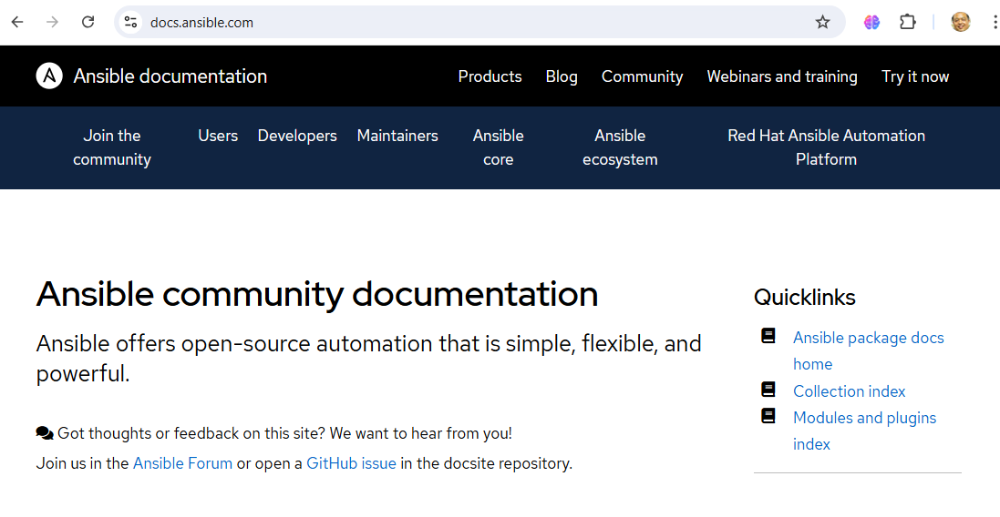

# แนะนำ Ansible
# Ansible คืออะไร

Ansible เป็นเครื่องมือที่ใช้ในการจัดการและการตั้งค่าโครงสร้างพื้นฐาน (Infrastructure) แบบอัตโนมัติ โดยมุ่งเน้นที่ความง่ายในการใช้งานและการตั้งค่า รวมถึงสามารถจัดการระบบในลักษณะต่าง ๆ เช่น การตั้งค่าเซิร์ฟเวอร์, การติดตั้งซอฟต์แวร์, และการจัดการคอนฟิกูเรชัน



## คุณสมบัติหลักของ Ansible

1. **การตั้งค่าและการจัดการโครงสร้างพื้นฐาน:** Ansible ใช้เพื่อจัดการโครงสร้างพื้นฐานทั้งในระดับเซิร์ฟเวอร์และแอปพลิเคชันอย่างมีประสิทธิภาพ โดยไม่ต้องใช้โค้ดที่ซับซ้อน

2. **ไม่ต้องติดตั้ง Agent:** Ansible ใช้การเชื่อมต่อ SSH (สำหรับระบบ Unix/Linux) หรือ WinRM (สำหรับ Windows) เพื่อทำการจัดการโฮสต์ โดยไม่ต้องติดตั้งโปรแกรมหรือ Agent เพิ่มเติมบนโฮสต์เป้าหมาย

3. **การใช้ YAML:** Ansible ใช้ YAML (YAML Ain't Markup Language) สำหรับการเขียน Playbooks ซึ่งเป็นไฟล์ที่ประกอบด้วยคำสั่งในการตั้งค่าและการจัดการโครงสร้างพื้นฐาน ซึ่งทำให้การอ่านและเขียนโค้ดทำได้ง่าย

4. **ความสามารถในการจัดการหลายโฮสต์พร้อมกัน:** Ansible สามารถจัดการหลายโฮสต์พร้อมกันจากจุดเดียว ทำให้การดำเนินการในสภาพแวดล้อมขนาดใหญ่มีประสิทธิภาพมากขึ้น

5. **การจัดการความลับและการเข้ารหัส:** Ansible Vault ช่วยให้สามารถจัดการข้อมูลลับ เช่น รหัสผ่าน หรือคีย์การเข้าถึง ได้อย่างปลอดภัย

6. **การใช้งานง่าย:** Ansible มีโครงสร้างที่เรียบง่ายและใช้งานง่าย ซึ่งช่วยลดความซับซ้อนในการจัดการโครงสร้างพื้นฐาน

## แนวทางการทำงานของ Ansible

1. **การเชื่อมต่อ:** Ansible เชื่อมต่อกับโฮสต์เป้าหมายผ่าน SSH หรือ WinRM

2. **การรัน Playbooks:** Ansible รันคำสั่งที่ระบุในไฟล์ Playbook ที่เขียนด้วย YAML

3. **การตรวจสอบและรายงานผล:** Ansible ตรวจสอบผลลัพธ์และรายงานสถานะการดำเนินการ

## ตัวอย่างการใช้งาน

- **การตั้งค่าเซิร์ฟเวอร์เว็บ:** ติดตั้งและตั้งค่าเซิร์ฟเวอร์เว็บ เช่น Apache หรือ Nginx
- **การจัดการแพ็กเกจ:** ติดตั้งหรืออัพเดตซอฟต์แวร์
- **การจัดการคอนฟิกูเรชัน:** ปรับแต่งการตั้งค่าต่าง ๆ ของระบบและแอปพลิเคชัน

## ตัวอย่าง Playbook

นี่คือตัวอย่างของไฟล์ Playbook ที่ใช้ในการติดตั้ง Nginx บนเซิร์ฟเวอร์:

```yaml
- name: Install and start Nginx
  hosts: webservers
  become: yes
  tasks:
    - name: Install Nginx
      apt:
        name: nginx
        state: present

    - name: Start Nginx service
      service:
        name: nginx
        state: started

```

# Ansible Engine

**Ansible Engine** คือส่วนหลักของ Ansible ที่ใช้ในการทำงานหลักในการจัดการและการตั้งค่าโครงสร้างพื้นฐาน (Infrastructure) แบบอัตโนมัติ มันเป็นเครื่องมือที่ใช้ในการควบคุมการทำงานของโฮสต์หลาย ๆ เครื่องจากจุดเดียวโดยไม่ต้องติดตั้งโปรแกรมหรือ agent เพิ่มเติมบนโฮสต์เป้าหมาย

## คุณสมบัติหลักของ Ansible Engine

1. **การควบคุมการทำงานจากจุดเดียว:** Ansible Engine ช่วยให้ผู้ใช้สามารถควบคุมการทำงานและการตั้งค่าหลาย ๆ โฮสต์จากจุดเดียวผ่านไฟล์ Playbook และคำสั่ง ad-hoc

2. **การใช้ YAML สำหรับ Playbooks:** ใช้ YAML (YAML Ain't Markup Language) ในการเขียน Playbooks ซึ่งเป็นไฟล์ที่กำหนดงานที่ต้องการให้ Ansible ทำ โดย Playbooks จะประกอบด้วยชุดของคำสั่งที่เรียงลำดับในการดำเนินการ

3. **การจัดการโฮสต์ผ่าน SSH หรือ WinRM:** Ansible Engine เชื่อมต่อกับโฮสต์เป้าหมายผ่าน SSH (สำหรับระบบ Unix/Linux) หรือ WinRM (สำหรับ Windows) โดยไม่ต้องติดตั้ง agent บนโฮสต์

4. **การทำงานแบบ Idempotent:** Ansible Engine ทำงานโดยมีลักษณะ idempotent หมายความว่าการรันคำสั่งเดียวกันหลายครั้งจะให้ผลลัพธ์เหมือนกันเสมอ โดยไม่ทำให้เกิดการเปลี่ยนแปลงที่ไม่จำเป็น

5. **การจัดการกับหลายโฮสต์พร้อมกัน:** Ansible Engine สามารถจัดการกับหลายโฮสต์พร้อมกันจากจุดเดียว โดยใช้การจัดกลุ่มโฮสต์และการจัดการงานแบบขนาน

6. **การจัดการความลับด้วย Ansible Vault:** Ansible Engine ใช้ Ansible Vault สำหรับการเข้ารหัสข้อมูลลับ เช่น รหัสผ่าน หรือคีย์การเข้าถึง เพื่อให้แน่ใจว่าข้อมูลสำคัญจะถูกจัดเก็บอย่างปลอดภัย

## ส่วนประกอบหลักของ Ansible Engine

1. **Playbooks:** ไฟล์ที่เขียนด้วย YAML ซึ่งกำหนดชุดของงานที่ Ansible จะทำบนโฮสต์เป้าหมาย

2. **Inventories:** ไฟล์ที่ระบุรายการโฮสต์และกลุ่มของโฮสต์ที่ Ansible จะจัดการ

3. **Modules:** ชุดของฟังก์ชันที่ใช้ในการดำเนินการต่าง ๆ บนโฮสต์ เช่น การติดตั้งซอฟต์แวร์หรือการคัดลอกไฟล์

4. **Roles:** การจัดกลุ่มของ tasks, handlers, และตัวแปรที่สามารถนำมาใช้ซ้ำได้ใน Playbooks

5. **Handlers:** คำสั่งพิเศษที่ถูกเรียกใช้เมื่อมีการเปลี่ยนแปลงที่ระบุไว้ใน Playbook

6. **Variables:** ตัวแปรที่ใช้ในการกำหนดค่าต่าง ๆ ภายใน Playbooks เพื่อให้สามารถปรับเปลี่ยนได้ตามต้องการ

## การใช้งาน Ansible Engine


การใช้งาน Ansible Engine มักจะรวมถึงการสร้างและรัน Playbooks เพื่อทำการตั้งค่าและจัดการโครงสร้างพื้นฐาน ซึ่งสามารถทำได้ผ่านบรรทัดคำสั่งหรือจากเครื่องมือการจัดการอื่น ๆ ที่รองรับ Ansible

Ansible Engine เป็นเครื่องมือที่มีความสามารถสูงและยืดหยุ่นในการจัดการโครงสร้างพื้นฐาน IT ช่วยให้การทำงานในสภาพแวดล้อมขนาดใหญ่และซับซ้อนได้อย่างมีประสิทธิภาพ

## การทดสอบการตั้งค่า
สามารถตรวจสอบการตั้งค่า Ansible ด้วยการใช้คำสั่ง
```
$ ansible --version
ansible [core 2.14.17]
  config file = /etc/ansible/ansible.cfg
  configured module search path = ['/home/vagrant/.ansible/plugins/modules', '/usr/share/ansible/plugins/modules']
  ansible python module location = /usr/lib/python3.9/site-packages/ansible
  ansible collection location = /home/vagrant/.ansible/collections:/usr/share/ansible/collections
  executable location = /usr/bin/ansible
  python version = 3.9.18 (main, Sep  7 2023, 00:00:00) [GCC 11.4.1 20230605 (Red Hat 11.4.1-2)] (/usr/bin/python3)
  jinja version = 3.1.2
  libyaml = True
```

## Inventory

เมื่อเริ่มใช้งาน Ansible (ไม่นับขั้นตอนการติดตั้ง) สิ่งแรกที่เราต้องมีคือไฟล์ **inventory** ที่จะช่วยให้ Ansible รู้ว่าเรากำลังจะจัดการกับเครื่องไหนบ้าง ไฟล์ inventory มีโครงสร้างที่ง่ายที่สุดในรูปแบบของไฟล์  ดังนี้:

```
[groupname]
host1
host2
```

- **ตัวอย่าง**
```
[db-servers]
db-01  ansible_host=192.168.124.243
db-02  ansible_host=192.168.124.182

[web-servers]
web-01  ansible_host=192.168.124.158
web-02  ansible_host=192.168.124.153
web-03  ansible_host=192.168.124.92
```

- save ไฟล์นี้ในชื่อไฟล์ว่า hosts

## การใช้ไฟล์ Inventory ทดสอบ connectivity
เมื่อมีไฟล์ inventory แล้ว คุณสามารถเรียกใช้ Ansible โดยระบุไฟล์ inventory ได้ด้วยการเพิ่มพารามิเตอร์ `-i hosts` (แทนที่ hosts ด้วยชื่อไฟล์ inventory ที่คุณสร้างขึ้น) ในคำสั่ง ansible หรือ ansible-playbook:
```
ansible -i hosts -m ping all
```

นอกจากนี้ คุณยังสามารถตั้งค่าให้ Ansible ใช้ไฟล์ inventory นี้โดยอัตโนมัติด้วยการสร้างไฟล์ ansible.cfg ในโฟลเดอร์เดียวกัน แล้วใส่ข้อความดังนี้:

```
[defaults]
inventory = hosts
remote_user = ubuntu
private_key_file = keys/ansibleSSH.pem
host_key_checking = False
```

## กำหนด SSH สำหรับ Target 

การกำหนด SSH Key
- โดยปกติแล้ว Ansible จะเชื่อมต่อกับเซิร์ฟเวอร์ตามที่เราระบุผ่าน SSH config และจะพยายามใช้ SSH key ในการเชื่อมต่อ (ถ้ามี) หากไฟล์ private key ของคุณไม่ใช่ชื่อ ~/.ssh/id_rsa คุณสามารถระบุคีย์ที่ใช้สำหรับแต่ละโฮสต์ในไฟล์ inventory ได้:

```
[groupname]
host1 ansible_private_key_file="/home/user/.ssh/privatekey1"
host2 ansible_private_key_file="/home/user/.ssh/privatekey2"
```

- หากทุกเซิร์ฟเวอร์ในกลุ่มใช้คีย์เดียวกัน คุณสามารถกำหนดคีย์เป็นตัวแปรของกลุ่มได้เช่นกัน:
```
[groupname]
host1
host2

[groupname:vars]
ansible_private_key_file="/home/user/.ssh/privatekey1"
```

หรือหากเราต้องการใช้รหัสผ่านในการเชื่อมต่อ (ไม่แนะนำ) สามารถตั้งรหัสผ่านไว้ให้แต่ละ host ได้ (ย้ำว่าไม่แนะนำ อย่าหาทำ) ลักษณะดังนี้

```
[groupname]
host1 ansible_password="123456"
host2 ansible_password="abcdef"
```
เมื่อได้ inventory แล้วสามารถทดสอบการเชื่อมต่อไปหา host ปลายทางได้โดยใช้คำสั่งดังนี้

```
ansible -i hosts -m ping all 
```
