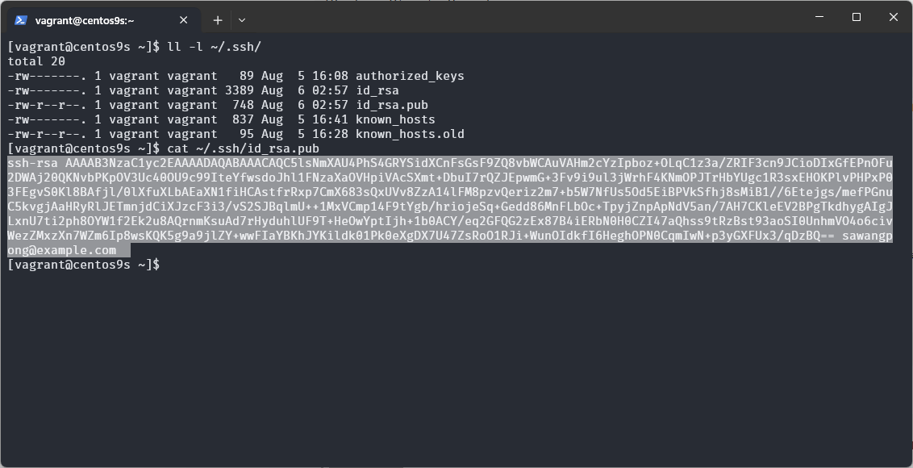

# การสร้าง ssh-key
การสร้าง SSH key ใน Linux เป็นขั้นตอนที่สำคัญในการตั้งค่าการเชื่อมต่อ SSH ที่ปลอดภัยระหว่างเครื่องของคุณกับเซิร์ฟเวอร์ระยะไกล นี่คือวิธีการสร้าง SSH key:

1. เปิด Terminal
คุณจะต้องเปิด Terminal หรือคอนโซลบนระบบ Linux ของคุณ

2. สร้าง SSH Key
ใช้คำสั่ง ssh-keygen เพื่อสร้าง SSH key ใหม่:

```
ssh-keygen -t rsa -b 4096 -C "your_email@example.com"
```

เช่น

```
[vagrant@centos9s ~]$ ssh-keygen -t rsa -b 4096 -C "sawangpong@example.com"
```

รายละเอียดคำสั่ง:

- **-t rsa:** กำหนดประเภทของคีย์ที่ต้องการสร้าง (RSA เป็นประเภทที่ใช้กันทั่วไป)
- **-b 4096:** กำหนดขนาดของคีย์ (4096 บิตคือขนาดที่แนะนำสำหรับความปลอดภัยที่ดี หรือ 2048 ถ้าต้องการให้ key มีขนาดเล็กลง)
- **-C "your_email@example.com":** เพิ่มคอมเมนต์หรือคำอธิบายให้กับคีย์ (มักจะใช้เพื่อการระบุ)

3. กำหนดที่เก็บและชื่อไฟล์
เมื่อคุณรันคำสั่งนี้ ระบบจะถามให้คุณระบุที่เก็บไฟล์คีย์และชื่อไฟล์:

```
Enter file in which to save the key (/home/username/.ssh/id_rsa):
```

หากคุณต้องการใช้ชื่อไฟล์เริ่มต้น (เช่น id_rsa), กด Enter ผ่าน หากต้องการเก็บคีย์ในที่อื่นหรือชื่ออื่น, ให้พิมพ์ที่อยู่และชื่อไฟล์ใหม่

4. ตั้งรหัสผ่าน (Passphrase)
ระบบจะถามให้คุณป้อนรหัสผ่าน (passphrase) เพื่อเพิ่มความปลอดภัย ในการใช้งาน key:

```
Enter passphrase (empty for no passphrase):
```
สามารถป้อนรหัสผ่านเพื่อเพิ่มชั้นความปลอดภัยเพิ่มเติม หรือกด Enter เพื่อไม่ใช้รหัสผ่าน 

5. ตรวจสอบการสร้างคีย์
เมื่อเสร็จสิ้นการสร้างคีย์, คุณจะเห็นข้อความเช่นนี้:

```
Your identification has been saved in /home/username/.ssh/id_rsa.
Your public key has been saved in /home/username/.ssh/id_rsa.pub.
```

ไฟล์ที่สร้างขึ้น:
- **id_rsa:** เป็นไฟล์ private key
- **id_rsa.pub:** เป็นไฟล์ public key


```
[vagrant@centos9s ~]$ ssh-keygen -t rsa -b 4096 -C "sawangpong@example.com"
Generating public/private rsa key pair.
Enter file in which to save the key (/home/vagrant/.ssh/id_rsa):
Enter passphrase (empty for no passphrase):
Enter same passphrase again:
Your identification has been saved in /home/vagrant/.ssh/id_rsa
Your public key has been saved in /home/vagrant/.ssh/id_rsa.pub
The key fingerprint is:
SHA256:DrJT09yI1VHxKYYz9uOzarAnnOKrmG89f6nmoG2YcsI sawangpong@example.com
The key's randomart image is:
+---[RSA 4096]----+
|          ..o.   |
|         . o . . |
|        . * o o  |
|       = + = .   |
|    . = S . o    |
|     + +.  . .   |
| .  o+...+ .o    |
|  Eo=+=.* =  o   |
|  o*+++B+*...    |
+----[SHA256]-----+
[vagrant@centos9s ~]$
```

```
[vagrant@centos9s ~]$ ll -l ~/.ssh/
total 20
-rw-------. 1 vagrant vagrant   89 Aug  5 16:08 authorized_keys
-rw-------. 1 vagrant vagrant 3389 Aug  6 02:57 id_rsa
-rw-r--r--. 1 vagrant vagrant  748 Aug  6 02:57 id_rsa.pub
-rw-------. 1 vagrant vagrant  837 Aug  5 16:41 known_hosts
-rw-r--r--. 1 vagrant vagrant   95 Aug  5 16:28 known_hosts.old
[vagrant@centos9s ~]$
```

6. เพิ่ม Public Key ไปยังเซิร์ฟเวอร์
เพื่อให้สามารถเชื่อมต่อกับเซิร์ฟเวอร์ระยะไกลด้วย SSH key, คุณจะต้องเพิ่ม public key (id_rsa.pub) ไปยังไฟล์ ~/.ssh/authorized_keys บนเซิร์ฟเวอร์:

- 6.1 คัดลอก Public Key ไปยัง Clipboard:

```
cat ~/.ssh/id_rsa.pub
```
เช่น
```
[vagrant@centos9s ~]$ cat ~/.ssh/id_rsa.pub
ssh-rsa AAAAB3NzaC1yc2EAAAADAQABAAACAQC5lsNmXAU4PhS4GRYSidXCnFsGsF9ZQ8vbWCAuVAHm2cYzIpboz+OLqC1z3a/ZRIF3cn9JCioDIxGfEPnOFu2DWAj20QKNvbPKpOV3Uc40OU9c99IteYfwsdoJhl1FNzaXaOVHpiVAcSXmt+DbuI7rQZJEpwmG+3Fv9i9ul3jWrhF4KNmOPJTrHbYUgc1R3sxEHOKPlvPHPxP03FEgvS0Kl8BAfjl/0lXfuXLbAEaXN1fiHCAstfrRxp7CmX683sQxUVv8ZzA14lFM8pzvQeriz2m7+b5W7NfUs5Od5EiBPVkSfhj8sMiB1//6Etejgs/mefPGnuC5kvgjAaHRyRlJETmnjdCiXJzcF3i3/vS2SJBqlmU++1MxVCmp14F9tYgb/hriojeSq+Gedd86MnFLbOc+TpyjZnpApNdV5an/7AH7CKleEV2BPgTkdhygAIgJLxnU7ti2ph8OYW1f2Ek2u8AQrnmKsuAd7rHyduhlUF9T+HeOwYptIjh+1b0ACY/eq2GFQG2zEx87B4iERbN0H0CZI47aQhss9tRzBst93aoSI0UnhmVO4o6civWezZMxzXn7WZm6Ip8wsKQK5g9a9jlZY+wwFIaYBKhJYKildk01Pk0eXgDX7U47ZsRoO1RJi+WunOIdkfI6HeghOPN0CqmIwN+p3yGXFUx3/qDzBQ== sawangpong@example.com
```



คัดลอกผลลัพธ์จากคำสั่งนี้ เพิ่ม Public Key ไปยัง Authorized Keys ( ~/.ssh/authorized_keys) บนเซิร์ฟเวอร์:

- 6.2 ใช้คำสั่ง ssh-copy-id เพื่อคัดลอกคีย์ของคุณไปยังเซิร์ฟเวอร์ auto:

```
ssh-copy-id user@remote_server
```

- 6.3 หรือเชื่อมต่อด้วย SSH และเพิ่มคีย์ด้วยตนเอง แบบ manual:

```
ssh user@remote_server
จากนั้นเพิ่ม public key ไปที่ไฟล์ ~/.ssh/authorized_keys บนเซิร์ฟเวอร์:
```

```
echo "your_public_key_content" >> ~/.ssh/authorized_keys
```

ตรวจสอบให้แน่ใจว่าไฟล์ authorized_keys มีสิทธิ์ที่ถูกต้อง:

```
chmod 600 ~/.ssh/authorized_key
```

7. ทดสอบการเชื่อมต่อ
ทดสอบการเชื่อมต่อด้วย SSH:

```
ssh user@remote_server
```

หากทุกอย่างถูกต้อง จะเข้าสู่เซิร์ฟเวอร์โดยไม่ต้องป้อนรหัสผ่าน (ถ้าคุณไม่ได้ตั้งรหัสผ่านสำหรับ SSH key)

**สรุป**

การสร้าง SSH key และตั้งค่าให้ถูกต้องเป็นขั้นตอนที่สำคัญในการทำให้การเชื่อมต่อ SSH มีความปลอดภัยและสะดวกสบายมากขึ้น โดยการทำตามขั้นตอนที่ระบุข้างต้น คุณจะสามารถสร้าง SSH key ใหม่และตั้งค่าให้พร้อมใช้งานได้