# Workshop Ansible
## ขั้นตอนการสร้าง Single Node LAMP Stack ด้วย Vagrant

### 1. การตั้งค่าโปรเจค
1. เปิดเทอร์มินัลหรือ PowerShell
2. สร้างไดเรกทอรีใหม่สำหรับโปรเจค
    ```sh
    mkdir vagrant-ansible
    cd vagrant-ansible
    ```

3. สร้าง Vagrantfile  ``code Vagrantfile``
```ruby
# -*- mode: ruby -*-
# vi: set ft=ruby :

# All Vagrant configuration is done below. The "2" in Vagrant.configure
# configures the configuration version (we support older styles for
# backwards compatibility). Please don't change it unless you know what
# you're doing.

$script=<<-SCRIPT
     sed -i 's/PasswordAuthentication no/PasswordAuthentication yes/g' /etc/ssh/sshd_config    
     systemctl restart sshd.service
     #sudo dnf install -y epel-release
     #sudo dnf install -y ansible
SCRIPT

Vagrant.configure("2") do |config|

  config.vm.box = "generic/centos9s"

  config.vm.network "private_network", ip: "192.168.33.20"
  #config.vm.network "public_network"
  config.vm.synced_folder ".", "/vagrant"
  config.vm.provider "virtualbox" do |vb|
    vb.memory = "2048"
    vb.cpus = 2
  end

  config.vm.provision "shell", inline: $script
end

```

Run:
```sh
vagrant up
```

Login ด้วย คำสั่ง vagrant 
```
vagrant ssh
```
หรือ ใช้คำสั่ง ssh
```
ssh vagrant@192.168.33.20
```

ติดตั้ง Ansible แบบ manual
```
[vagrant@centos9s ~]$ sudo dnf install -y epel-release
[vagrant@centos9s ~]$ sudo dnf install -y ansible
Last metadata expiration check: 0:00:48 ago on Thu 01 Aug 2024 01:27:45 PM UTC.
Dependencies resolved.
========================================================================================================
 Package                        Architecture     Version                      Repository           Size
========================================================================================================
Installing:
 ansible                        noarch           1:7.7.0-1.el9                epel                 34 M
Installing dependencies:
 ansible-core                   x86_64           1:2.14.17-1.el9              appstream           2.6 M
 git-core                       x86_64           2.43.5-1.el9                 appstream           4.4 M
 python3-cffi                   x86_64           1.14.5-5.el9                 baseos              253 k
 python3-cryptography           x86_64           36.0.1-4.el9                 baseos              1.2 M
 python3-packaging              noarch           20.9-5.el9                   appstream            77 k
 python3-ply                    noarch           3.11-14.el9                  baseos              106 k
 python3-pycparser              noarch           2.20-6.el9                   baseos              135 k
 python3-pyyaml                 x86_64           5.4.1-6.el9                  baseos              205 k
 python3-resolvelib             noarch           0.5.4-5.el9                  appstream            34 k
 python3-setuptools             noarch           53.0.0-13.el9                baseos              943 k
 sshpass                        x86_64           1.09-4.el9                   appstream            28 k

Transaction Summary
========================================================================================================
Install  12 Packages

Total download size: 44 M
Installed size: 407 M
Is this ok [y/N]: y
Downloading Packages:
(1/12): python3-ply-3.11-14.el9.noarch.rpm                              141 kB/s | 106 kB     00:00
(2/12): python3-cffi-1.14.5-5.el9.x86_64.rpm                            268 kB/s | 253 kB     00:00
(3/12): python3-pyyaml-5.4.1-6.el9.x86_64.rpm                           825 kB/s | 205 kB     00:00
(4/12): python3-pycparser-2.20-6.el9.noarch.rpm                         117 kB/s | 135 kB     00:01
(5/12): python3-cryptography-36.0.1-4.el9.x86_64.rpm                    530 kB/s | 1.2 MB     00:02
(6/12): python3-setuptools-53.0.0-13.el9.noarch.rpm                     680 kB/s | 943 kB     00:01
(7/12): python3-packaging-20.9-5.el9.noarch.rpm                         145 kB/s |  77 kB     00:00
(8/12): python3-resolvelib-0.5.4-5.el9.noarch.rpm                       237 kB/s |  34 kB     00:00
(9/12): sshpass-1.09-4.el9.x86_64.rpm                                   217 kB/s |  28 kB     00:00
(10/12): ansible-core-2.14.17-1.el9.x86_64.rpm                          1.6 MB/s | 2.6 MB     00:01
(11/12): git-core-2.43.5-1.el9.x86_64.rpm                               1.5 MB/s | 4.4 MB     00:02
(12/12): ansible-7.7.0-1.el9.noarch.rpm                                 4.6 MB/s |  34 MB     00:07
--------------------------------------------------------------------------------------------------------
Total                                                                   2.9 MB/s |  44 MB     00:15
Running transaction check
Transaction check succeeded.
Running transaction test
Transaction test succeeded.
Running transaction
  Preparing        :                                                                                1/1
  Installing       : sshpass-1.09-4.el9.x86_64                                                     1/12
  Installing       : python3-resolvelib-0.5.4-5.el9.noarch                                         2/12
  Installing       : python3-packaging-20.9-5.el9.noarch                                           3/12
  Installing       : git-core-2.43.5-1.el9.x86_64                                                  4/12
  Installing       : python3-setuptools-53.0.0-13.el9.noarch                                       5/12
  Installing       : python3-pyyaml-5.4.1-6.el9.x86_64                                             6/12
  Installing       : python3-ply-3.11-14.el9.noarch                                                7/12
  Installing       : python3-pycparser-2.20-6.el9.noarch                                           8/12
  Installing       : python3-cffi-1.14.5-5.el9.x86_64                                              9/12
  Installing       : python3-cryptography-36.0.1-4.el9.x86_64                                     10/12
  Installing       : ansible-core-1:2.14.17-1.el9.x86_64                                          11/12
  Installing       : ansible-1:7.7.0-1.el9.noarch                                                 12/12
  Running scriptlet: ansible-1:7.7.0-1.el9.noarch                                                 12/12
  Verifying        : python3-cffi-1.14.5-5.el9.x86_64                                              1/12
  Verifying        : python3-cryptography-36.0.1-4.el9.x86_64                                      2/12
  Verifying        : python3-ply-3.11-14.el9.noarch                                                3/12
  Verifying        : python3-pycparser-2.20-6.el9.noarch                                           4/12
  Verifying        : python3-pyyaml-5.4.1-6.el9.x86_64                                             5/12
  Verifying        : python3-setuptools-53.0.0-13.el9.noarch                                       6/12
  Verifying        : ansible-core-1:2.14.17-1.el9.x86_64                                           7/12
  Verifying        : git-core-2.43.5-1.el9.x86_64                                                  8/12
  Verifying        : python3-packaging-20.9-5.el9.noarch                                           9/12
  Verifying        : python3-resolvelib-0.5.4-5.el9.noarch                                        10/12
  Verifying        : sshpass-1.09-4.el9.x86_64                                                    11/12
  Verifying        : ansible-1:7.7.0-1.el9.noarch                                                 12/12

Installed:
  ansible-1:7.7.0-1.el9.noarch                         ansible-core-1:2.14.17-1.el9.x86_64
  git-core-2.43.5-1.el9.x86_64                         python3-cffi-1.14.5-5.el9.x86_64
  python3-cryptography-36.0.1-4.el9.x86_64             python3-packaging-20.9-5.el9.noarch
  python3-ply-3.11-14.el9.noarch                       python3-pycparser-2.20-6.el9.noarch
  python3-pyyaml-5.4.1-6.el9.x86_64                    python3-resolvelib-0.5.4-5.el9.noarch
  python3-setuptools-53.0.0-13.el9.noarch              sshpass-1.09-4.el9.x86_64

Complete!
```

```
[vagrant@centos9s ~]$ sudo dnf info ansible
Extra Packages for Enterprise Linux 9 - x86_64                          3.4 kB/s | 4.6 kB     00:01
Installed Packages
Name         : ansible
Epoch        : 1
Version      : 7.7.0
Release      : 1.el9
Architecture : noarch
Size         : 365 M
Source       : ansible-7.7.0-1.el9.src.rpm
Repository   : @System
From repo    : epel
Summary      : Curated set of Ansible collections included in addition to ansible-core
URL          : https://ansible.com
License      : GPL-3.0-or-later AND Apache-2.0 AND BSD-2-Clause AND BSD-3-Clause AND MIT AND MPL-2.0 AND
             : PSF-2.0
Description  : Ansible is a radically simple model-driven configuration management,
             : multi-node deployment, and remote task execution system. Ansible works
             : over SSH and does not require any software or daemons to be installed
             : on remote nodes. Extension modules can be written in any language and
             : are transferred to managed machines automatically.
             :
             : This package provides a curated set of Ansible collections included in addition
             : to ansible-core.
```

```
[vagrant@centos9s ~]$ sudo dnf info ansible-core
Extra Packages for Enterprise Linux 9 - Next - x86_64                    11 kB/s |  17 kB     00:01
Installed Packages
Name         : ansible-core
Epoch        : 1
Version      : 2.14.17
Release      : 1.el9
Architecture : x86_64
Size         : 10 M
Source       : ansible-core-2.14.17-1.el9.src.rpm
Repository   : @System
From repo    : appstream
Summary      : SSH-based configuration management, deployment, and task execution system
URL          : http://ansible.com
License      : GPLv3+
Description  : Ansible is a radically simple model-driven configuration management,
             : multi-node deployment, and remote task execution system. Ansible works
             : over SSH and does not require any software or daemons to be installed
             : on remote nodes. Extension modules can be written in any language and
             : are transferred to managed machines automatically.
```

Run คำสั่งเพื่อ อ่าน คู่มือการใช้
```
man ansible
```
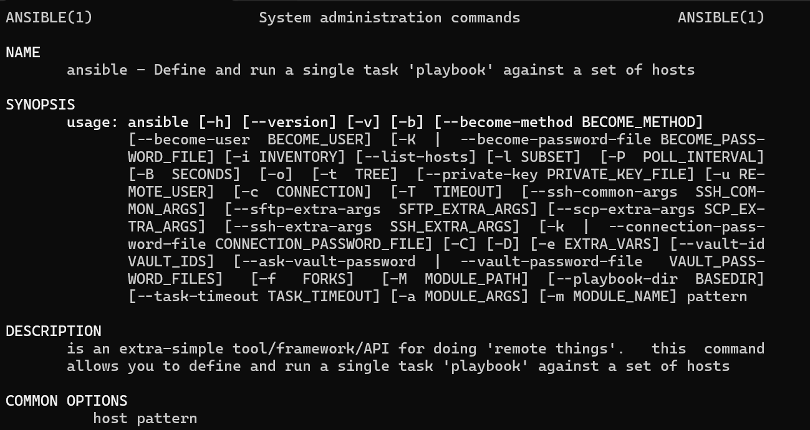

Run คำสั่ง
```
[vagrant@centos9s ~]$ ansible --version
ansible [core 2.14.17]
  config file = /etc/ansible/ansible.cfg
  configured module search path = ['/home/vagrant/.ansible/plugins/modules', '/usr/share/ansible/plugins/modules']
  ansible python module location = /usr/lib/python3.9/site-packages/ansible
  ansible collection location = /home/vagrant/.ansible/collections:/usr/share/ansible/collections
  executable location = /usr/bin/ansible
  python version = 3.9.18 (main, Sep  7 2023, 00:00:00) [GCC 11.4.1 20230605 (Red Hat 11.4.1-2)] (/usr/bin/python3)
  jinja version = 3.1.2
  libyaml = True
```

# เริ่มต้นการใช้งาน Ansible
คำสั่ง ใน Anible มีอยู่ด้วยกัน 2 คำสั่ง คือ `ansible` และ `ansible-playbook` มีรูปแบบในการใชงานคำสั่งดังนี้

ansible:
```
ansible -i <inventory_file> <host patterns> -m <module>
```

ansible-playbook:
```
ansible-playbook -i <inventory_file> <playbook_file> 
```

## Test Connection ไปยัง Host
Run คำสั่ง  check connection ด้วย module ชื่อ ping
```
ansible localhost -m ping
```
โดยคำสั่ง ``ansible localhost -h ping`` เป็นการใช้ทดสอบ connectivity ไปยัง localhost สามารถแยกคำสั่งได้ดังนี้

- **ansible:** เครื่องมือบรรทัดคำสั่งสำหรับการรันคำสั่ง ad-hoc ด้วย Ansible
- **localhost:** โฮสต์เป้าหมายสำหรับคำสั่ง Ansible ในกรณีนี้คือเครื่องของเราเอง
- **-m ping:** ตัวเลือก -m ใช้เพื่อระบุโมดูลที่ต้องการใช้ โดย ping เป็นโมดูลง่ายๆ ของ Ansible ที่ตรวจสอบว่าเป้าหมายสามารถเข้าถึงได้หรือไม่

Result
```
localhost | SUCCESS => {
    "changed": false,
    "ping": "pong"
}
```
ซึ่งหมายความว่าโมดูล ping ได้ทำการติดต่อกับ localhost สำเร็จ และได้รับการตอบกลับเป็น "pong" แสดงว่าการเชื่อมต่อนั้นดี หากมีข้อผิดพลาด ข้อความที่แสดงจะช่วยให้คุณสามารถวิเคราะห์ปัญหาได้ครับ

Run คำสั่ง ด้วย ``module command`` เพื่อส่งคำสั่งที่เราต้องการ ไปทำงาน ใน server เป้าหมาย
```
[vagrant@centos9s ~]$ ansible localhost -m command -a "uptime"
localhost | CHANGED | rc=0 >>
 13:51:41 up 33 min,  1 user,  load average: 0.08, 0.05, 0.08
```
ผลลัพธ์ที่ได้จากคำสั่งนี้จะเป็นการแสดงระยะเวลาที่เครื่องทำงานมาตั้งแต่การเริ่มต้นเครื่อง

**รายละเอียด คำสั่ง:**  `ansible localhost -m command -a "uptime"` ทำงานดังนี้:

- **ansible:** เครื่องมือบรรทัดคำสั่งสำหรับการรันคำสั่ง ad-hoc ด้วย Ansible
- **localhost:** โฮสต์เป้าหมายที่คำสั่ง Ansible จะถูกส่งไป ซึ่งในกรณีนี้คือตัวเครื่องของคุณเอง
- **-m command:** ตัวเลือก `-m` ใช้เพื่อระบุโมดูลที่ต้องการใช้ ในที่นี้คือโมดูล `command` ซึ่งใช้สำหรับรันคำสั่งทั่วไป
- **-a "uptime":** ตัวเลือก `-a` ใช้เพื่อระบุพารามิเตอร์ของโมดูล ในที่นี้คือคำสั่ง `uptime` ซึ่งจะแสดงระยะเวลาที่เครื่องทำงานอยู่


## ทำการทดสอบ ansible Host สำหรับ Ansible 

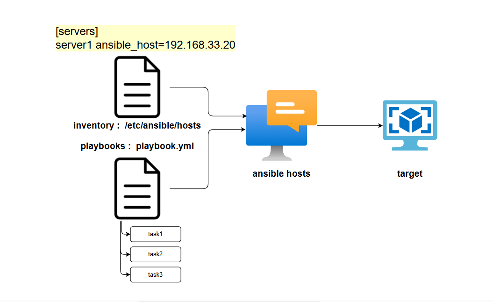

เพิ่ม  ansible host ใน file `/etc/ansible/hosts` และต้องใช้สิทธิของผู้ดูแลระบบ  เรียก file นี้ว่า 

Inventory ใช้ ค่า defaults
```
[vagrant@centos9s ~]$  ls -l /etc/ansible
total 8
-rw-r--r--. 1 root root  614 May 23 19:53 ansible.cfg
-rw-r--r--. 1 root root 1175 May 23 19:53 hosts
drwxr-xr-x. 2 root root    6 May 23 19:53 roles

[vagrant@centos9s ~]$  sudo vim /etc/ansible/hosts
```

ให้ทำการ เพิ่ม inventory  ต่อท้าย ของ file /etc/ansible/hosts
```
[servers]
server1 ansible_host=192.168.33.20
```

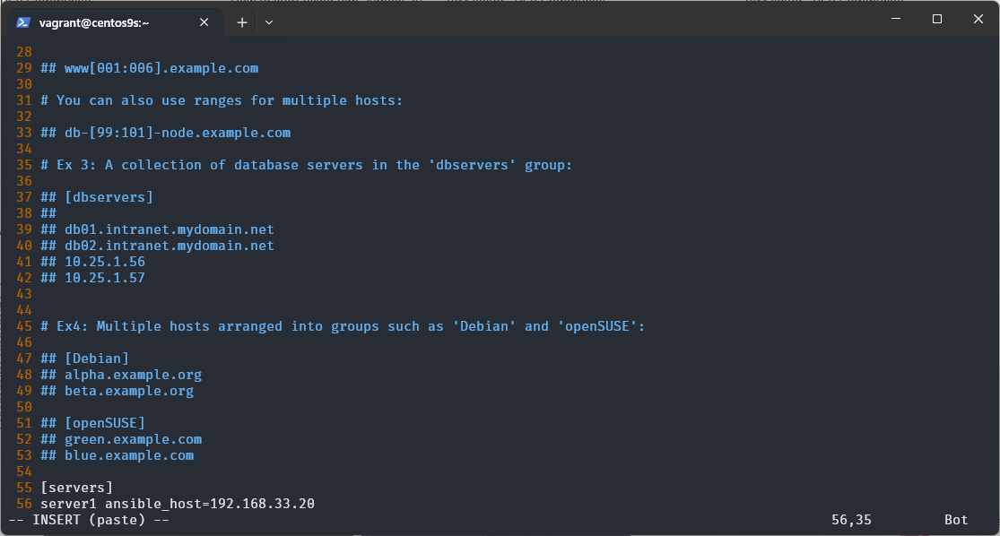

```admonish
คำสั่งพื้นฐาน VIM โดยใช้ key combination
- **ESC** เข้าสู่ โหมด command
- **i** เข้าสู่ โหมด insert
- **shift + g** ย้าย cursor ไป บรรทัดสุดท้าย  (กดปุ่ม shift พร้อมกับ g หรือ Capital G)
- **:se nu** เปิด หมายเลข บรรทัด
```

Run ทำสอบการเชื่อมต่อ and test ansible add hoc command 
```
ansible -m ping servers
```


```admonish info
หากไม่มีการกำหนด `-i /etc/ansible/hosts` ansible ก็ไปอ่านค่า ใน  `-i /etc/ansible/hosts` เพราะเป็นค่า Default

หรือ `[vagrant@centos9s ~]$ ansible servers -i /etc/ansible/hosts -m ping`

หรือ `[vagrant@centos9s ~]$ ansible server1 -i /etc/ansible/hosts -m ping`
```

ผลที่ได้ ก็จะเกิด  Errors: ด้านล่างนั้ เนื่องจาก ไม่สามารถทำการ Authentication
```
[vagrant@centos9s ~]$ ansible -m ping servers
The authenticity of host '192.168.33.20 (192.168.33.20)' can't be established.
ED25519 key fingerprint is SHA256:0pRyAhg91dyKvyciyc8HBUSDZ8eCkTh60zcecnNZFso.
This key is not known by any other names
Are you sure you want to continue connecting (yes/no/[fingerprint])? yes

server1 | UNREACHABLE! => {
    "changed": false,
    "msg": "Failed to connect to the host via ssh: Warning: Permanently added '192.168.33.20' (ED25519) to the list of known hosts.\r\nvagrant@192.168.33.20: Permission denied (publickey,gssapi-keyex,gssapi-with-mic,password).",
    "unreachable": true
}
```

```admonish error
Error ที่เห็น เป็น Error ปรกติ เนื่องจาก ไม่สามารถ authentication ไปยังเครื่องเป้าหมายได้
ดังนั้น การแก้ปัญหาดังกล่าวสามารถดำเนินได้จาก คำแนะนำด้านล่าง ต่อไปนี้
```

## แก้ Error โดยจะต้องเลือก กำหนดรูปแบบของการทำ Authentication
Ansible ใช้วิธีการหลายวิธีในการทำการ authentication (การตรวจสอบสิทธิ์) กับโฮสต์ที่มันจัดการ ซึ่งวิธีที่ใช้จะขึ้นอยู่กับประเภทของการเชื่อมต่อที่คุณเลือกใช้ นี่คือวิธีการหลัก ๆ ที่ใช้ในการ authentication:

### วิธีที่ 1 การใช้ Password-Based Authentication

การใช้รหัสผ่านเป็นอีกทางเลือกหนึ่งในการทำการ authentication แต่ไม่เป็นที่นิยมเท่าการใช้ SSH key เพราะมันอาจจะมีความเสี่ยงด้านความปลอดภัย:


- **กำหนด username/password  ใน Cli** 

การตั้งค่า: ไม่ต้องการแก้ไข file inventory 
การใช้งาน: ระบุค่า --user และ --ask-pass ใน command line ได้เลยทันที

```
[vagrant@centos9s ~]$ ansible -m ping servers --user vagrant --ask-pass
SSH password:
server1 | SUCCESS => {
    "ansible_facts": {
        "discovered_interpreter_python": "/usr/bin/python3"
    },
    "changed": false,
    "ping": "pong"
}
```
Ansible จะรอให้กรอกรหัสของ user vagrant คือ vagrant

- **กำหนดไว้ใน inventory**

การตั้งค่า: ระบุ ค่า password เพิ่มเติมใน Inventory โดยตรง
การใช้งาน: 

```
[servers]
server1 ansible_host=192.168.33.20 ansible_ssh_pass=vagrant
```

```
[vagrant@centos9s ~]$ ansible -m ping servers
```

- **encode password ไว้ใน File**
ใช้คำสั่ง ansible-vault เพื่อเก็บข้อมูลของ password ใน secrets.yml แบบ Encryption

```
[vagrant@centos9s ~]$ ansible-vault create secrets.yml
New Vault password:
Confirm New Vault password:
```
```admonish
New Vault password:   ใช้กำหนด password เมื่อมีการใช้งาน files ไม่ใช่ password ของ target
```

หลังจาก กรอก password คำสั่ง ansible-vault command จะทำการเปิด file ด้วย editor $EDITOR ซึ่งส่วนมากคือ vim ซื่งจะต้องกรอกข้อมูล password ดังนี้

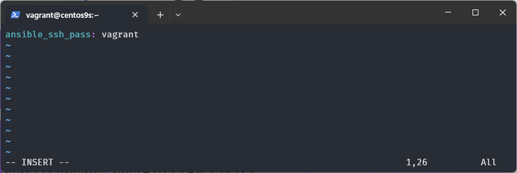

ให้กด `i` สำหรับ mode insert และ
เพ่ิ่ม `ansible_ssh_pass: password`  ใน Temporary file (file ที่ คำสั่ง ansible-vault เตรียมไว้เรานั้น ใช้ Vi เป็น Editor)
```
ansible_ssh_pass: vagrant
```
ทำการบันทึก ด้วยการกด  `:wq!`

```
cat secrets.yml
```
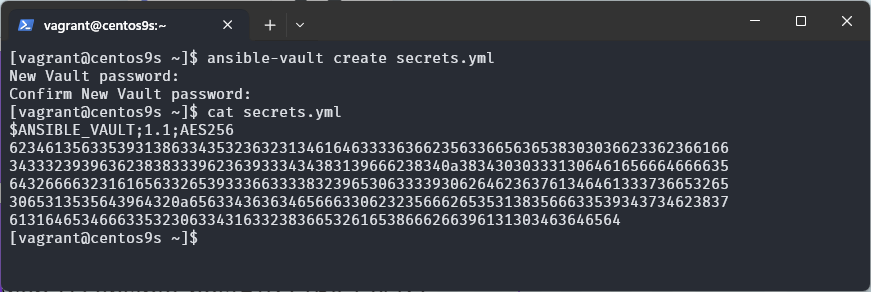
- content ใน file จะเป็น ascii text

```
[vagrant@centos9s ~]$ ansible -m ping servers --vault-password-file secrets.yml
```


### วิธีที่ 2 การใช้ SSH Key-Based Authentication
เป็นวิธีที่นิยมที่สุดในการทำการ authentication ไปยังโฮสต์:

- **การตั้งค่า:** 
  - สร้างคู่คีย์ SSH (private และ public) และคัดลอกคีย์ public ไปยังโฟลเดอร์ ~/.ssh/authorized_keys บนโฮสต์เป้าหมาย
การใช้งาน: ในการเชื่อมต่อ Ansible จะใช้คีย์ private ของคุณเพื่อทำการล็อกอินไปยังโฮสต์เป้าหมาย
การกำหนดค่าใน Ansible: โดยทั่วไป Ansible ใช้คีย์ส่วนตัวที่อยู่ใน ~/.ssh/id_rsa หากคุณใช้คีย์ที่ต่างออกไป คุณสามารถกำหนดค่าในไฟล์ ansible.cfg หรือระบุผ่านตัวเลือก --private-key


```
[vagrant@centos9s ~]$ ssh-keygen -t rsa
Generating public/private rsa key pair.
Enter file in which to save the key (/home/vagrant/.ssh/id_rsa):
Enter passphrase (empty for no passphrase):
Enter same passphrase again:
Your identification has been saved in /home/vagrant/.ssh/id_rsa
Your public key has been saved in /home/vagrant/.ssh/id_rsa.pub
The key fingerprint is:
SHA256:HW/BTDsM1d3NAfvmuizrlF8niHtf/b/KJnm8OiZPaIw vagrant@centos9s.localdomain
The key's randomart image is:
+---[RSA 3072]----+
|          ..oo.++|
|           * .o =|
|          . B.   |
|         . o o.  |
|        S . o  o |
|        o .o..o .|
|       E +.++ .o+|
|        ..oB=+ooo|
|          **OX=.=|
+----[SHA256]-----+

[vagrant@centos9s ~]$ ls -l ~/.ssh/id*
[vagrant@centos9s ~]$ ls -l  ~/.ssh/
total 20
-rw-------. 1 vagrant vagrant 2622 Aug  6 15:17 id_rsa
-rw-r--r--. 1 vagrant vagrant  582 Aug  6 15:17 id_rsa.pub
-rw-------. 1 vagrant vagrant  837 Aug  6 15:20 known_hosts
-rw-r--r--. 1 vagrant vagrant   95 Aug  6 15:20 known_hosts.old
```
- **Enter** ผ่านทุกคำถาม คำสั่ง `ssh-keygen` ใช้เพื่อสร้าง public key และ private key

```
[vagrant@centos9s ~]$ ssh-copy-id vagrant@192.168.33.20
/usr/bin/ssh-copy-id: INFO: Source of key(s) to be installed: "/home/vagrant/.ssh/id_rsa.pub"
The authenticity of host '192.168.33.20 (192.168.33.20)' can't be established.
ED25519 key fingerprint is SHA256:Ytf6GyGqIeJsIGL5Es1OQ50GqP2ZkMJj5sR3mYsACJ8.
This key is not known by any other names
Are you sure you want to continue connecting (yes/no/[fingerprint])? yes
/usr/bin/ssh-copy-id: INFO: attempting to log in with the new key(s), to filter out any that are already installed
/usr/bin/ssh-copy-id: INFO: 1 key(s) remain to be installed -- if you are prompted now it is to install the new keys
vagrant@192.168.33.20's password:

Number of key(s) added: 1

Now try logging into the machine, with:   "ssh 'vagrant@192.168.33.20'"
and check to make sure that only the key(s) you wanted were added.

[vagrant@centos9s ~]$ ls -l  ~/.ssh/
total 20
-rw-------. 1 vagrant vagrant  671 Aug  6 15:20 authorized_keys
-rw-------. 1 vagrant vagrant 2622 Aug  6 15:17 id_rsa
-rw-r--r--. 1 vagrant vagrant  582 Aug  6 15:17 id_rsa.pub
-rw-------. 1 vagrant vagrant  837 Aug  6 15:20 known_hosts
-rw-r--r--. 1 vagrant vagrant   95 Aug  6 15:20 known_hosts.old

```
- **SUCCESS** เพิ่ม publickey ไว้ใน file  authorized_keys

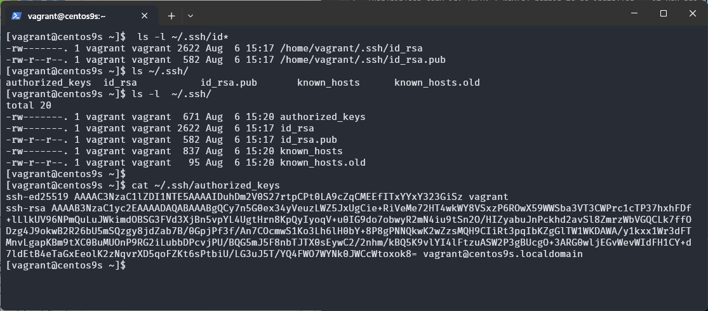

### การทดสอบ ssh key
ให้ทำการ ssh ไปยัง Target ผลที่ได้คือ สามารถ ssh ได้โดยไม่จำเป็นต้องใส่  password

```
[vagrant@centos9s ~]$ ssh vagrant@192.168.33.20
Last login: Tue Aug  6 15:01:51 2024 from 10.0.2.2
[vagrant@centos9s ~]$
```

```admonish
ssh-key เป็นวิธีที่ได้รรับความนิยมสูงสุด
```


## Workshop: สร้าง playbook.yml 
เป้าหมาย สร้าง Playbook.yml และ hosts ใน vagrant user
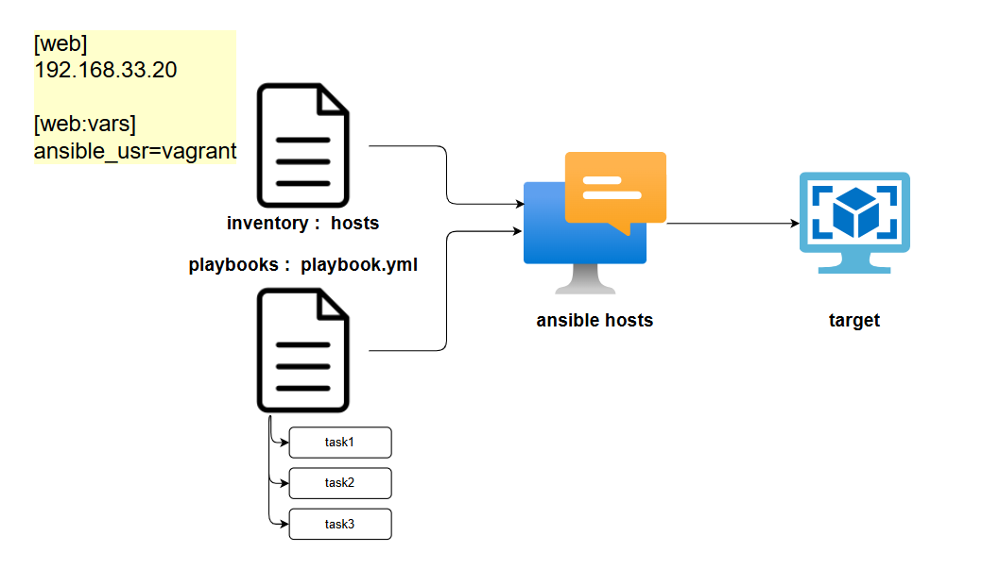

### สร้าง inventory ของ Project เอง ชื่อว่า host และ สร้าง playbook สำหรับการทำ Auto

- **ขั้นที่ 1** สร้าง playbook.yml
```
[vagrant@centos9s ~]$ vim playbook.yml
```
## playbook.yml
```
---
- name: install nginx and start service
  hosts: web
  become: true
  tasks:

   - name: install nginx
     yum: name=nginx state=present

   - name: start service
     service: name=nginx state=restarted
```

- **ขั้นที่ 2** สร้าง hosts

```
[vagrant@centos9s ~]$ vim hosts
```
content
```
[web]
192.168.33.20

[web:vars]
ansible_usr=vagrant
```

ตรวจสอบ File System ด้วยคำสั่ง `ls -l` ได้เห็น file ที่สร้าง
```
[vagrant@centos9s ~]$ ls -l
total 8
-rw-r--r--. 1 vagrant vagrant  19 Aug  1 12:19 hosts
-rw-r--r--. 1 vagrant vagrant 224 Aug  1 12:20 playbook.yml
```

Run
```
[vagrant@centos9s ~]$ ansible web -i hosts -m ping
192.168.33.20 | UNREACHABLE! => {
    "changed": false,
    "msg": "Failed to connect to the host via ssh: vagrant@192.168.33.20: Permission denied (publickey,gssapi-keyex,gssapi-with-mic,password).",
    "unreachable": true
}
```

```
[vagrant@centos9s ~]$ ansible all -i hosts -m ping
192.168.33.20 | UNREACHABLE! => {
    "changed": false,
    "msg": "Failed to connect to the host via ssh: vagrant@192.168.33.20: Permission denied (publickey,gssapi-keyex,gssapi-with-mic,password).",
    "unreachable": true
}
```

Run
```
[vagrant@centos9s ~]$ ansible-playbook -i hosts playbook.yml
```


โดย default แล้ว ansible เลือกใช้วิธี ssh-key authentication แต่ ซื่งจะต้องทำการ Copy ssh-key จากเครื่อง controller ไปยัง เครื่อง servers ที่ระบุใน inventory

วิธีแรก ลองทดสอบ แบบ password authentication ส่วน user จะเป็นชื่อ user บน shell ของเครื่อง controller (user vagrant)
```
[web]
192.168.33.20  ansible_ssh_pass=vagrant
```

ลองทดสอบอีกครั้ง จะพบว่า error เปลี่ยนเป็น Success
```
[vagrant@centos9s ~]$ ansible all -i host -m ping
192.168.33.20 | SUCCESS => {
    "ansible_facts": {
        "discovered_interpreter_python": "/usr/bin/python3"
    },
    "changed": false,
    "ping": "pong"
}
```

แต่สำหรับวิธีการใช้ password แบบที่กำหนดค่า password โดยตรงลงไปใน ไฟล์ invetory ทำให้เกิดความเสียงสูง ดังนั้น จะใช้ คำสั่ง ```ansible-value``` เพื่อทำการ Encrypt password  โดยใช้คำสั่ง

```
[vagrant@centos9s ~]$ ansible-vault create secrets.yml
New Vault password:
Confirm New Vault password:
```

เพิ่มตัวแปร ไปยัง Temporary File (โดยใช้ VI editor) 
```
ansible_ssh_pass: vagrant
```

หลังจากนั้น ansible-vaule จะencrypt password ไปเก็บไว้ใน secrets.yml

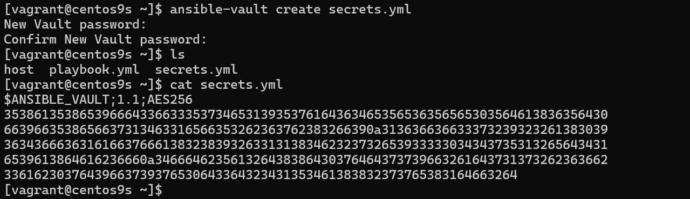

ansible_config
```
[vagrant@centos9s ~]$ ansible all -i hosts -m ping
192.168.33.20 | SUCCESS => {
    "ansible_facts": {
        "discovered_interpreter_python": "/usr/bin/python3"
    },
    "changed": false,
    "ping": "pong"
}
```

กลับไปที่วิธี ของ ssh key ต้องสร้าง ssh key ก่อน 
```
ssh-keygen -t rsa
```

```
[vagrant@centos9s ~]$ ssh-keygen -t rsa
Generating public/private rsa key pair.
Enter file in which to save the key (/home/vagrant/.ssh/id_rsa):
Enter passphrase (empty for no passphrase):
Enter same passphrase again:
Your identification has been saved in /home/vagrant/.ssh/id_rsa
Your public key has been saved in /home/vagrant/.ssh/id_rsa.pub
The key fingerprint is:
SHA256:toTj+jA2qXwjwVVa3Pt7BS1wpOwHpcZZvZcjVdTRnN8 vagrant@centos9s.localdomain
The key's randomart image is:
+---[RSA 3072]----+
|     . .   .+. +O|
|      + .o.*. .o+|
|     +   .Oo ...+|
|    o  ..o .o.ooE|
| . .  o S.. .o...|
|  o  o + ...  .  |
|   .* . .  . .   |
| ..oo=    . .    |
|  oo.o.    .     |
+----[SHA256]-----+
```

copy public key ด้วยคำสั่ง ssh-copy-id ไปยัง server
```
[vagrant@centos9s ~]$ ssh-copy-id vagrant@192.168.33.20
/usr/bin/ssh-copy-id: INFO: Source of key(s) to be installed: "/home/vagrant/.ssh/id_rsa.pub"
/usr/bin/ssh-copy-id: INFO: attempting to log in with the new key(s), to filter out any that are already installed
/usr/bin/ssh-copy-id: INFO: 1 key(s) remain to be installed -- if you are prompted now it is to install the new keys
vagrant@192.168.33.20's password:

Number of key(s) added: 1

Now try logging into the machine, with:   "ssh 'vagrant@192.168.33.20'"
and check to make sure that only the key(s) you wanted were added.
```

อีกขั้นตอน
```
[web]
192.168.33.20 ansible_ssh_private_key_file=~/.ssh/id_rsa
```

คราวนี้ลองทดสอบคำสั่ง อีกครั้ง
```
[vagrant@centos9s ~]$ ansible all -i host -m ping
192.168.33.20 | SUCCESS => {
    "ansible_facts": {
        "discovered_interpreter_python": "/usr/bin/python3"
    },
    "changed": false,
    "ping": "pong"
}
```

หรือ ให้ระบุ ใน Ansible config file  (`ansible.cfg`)

```
[vagrant@centos9s ~]$ sudo vim /etc/ansible/ansible.cfg
```

```
[defaults]
private_key_file =~/.ssh/id_rsa
```

Result
```
[vagrant@centos9s ~]$ ansible all -i host -m ping
192.168.33.20 | SUCCESS => {
    "ansible_facts": {
        "discovered_interpreter_python": "/usr/bin/python3"
    },
    "changed": false,
    "ping": "pong"
}
```


```
[vagrant@centos9s ~]$ ansible-playbook -i host playbook.yml
```

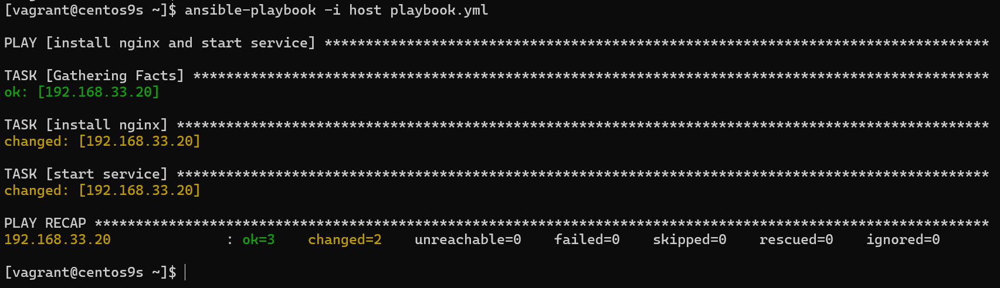

```
[vagrant@centos9s ~]$ ss -tulpn
Netid      State       Recv-Q      Send-Q            Local Address:Port             Peer Address:Port      Process
udp        UNCONN      0           0                     127.0.0.1:323                   0.0.0.0:*
udp        UNCONN      0           0                         [::1]:323                      [::]:*
tcp        LISTEN      0           511                     0.0.0.0:80                    0.0.0.0:*
tcp        LISTEN      0           128                     0.0.0.0:22                    0.0.0.0:*
tcp        LISTEN      0           511                        [::]:80                       [::]:*
tcp        LISTEN      0           128                        [::]:22                       [::]:*
[vagrant@centos9s ~]$
```

```
vagrant halt
vagrant destroy
```

แก้ไขfile Vagrantfile
```
# -*- mode: ruby -*-
# vi: set ft=ruby :

# All Vagrant configuration is done below. The "2" in Vagrant.configure
# configures the configuration version (we support older styles for
# backwards compatibility). Please don't change it unless you know what
# you're doing.

$script=<<-SCRIPT
    sed -i 's/PasswordAuthentication no/PasswordAuthentication yes/g' /etc/ssh/sshd_config    
    systemctl restart sshd.service
SCRIPT

Vagrant.configure("2") do |config|
  # The most common configuration options are documented and commented below.
  # For a complete reference, please see the online documentation at
  # https://docs.vagrantup.com.
  config.vm.box = "generic/centos9s"

  config.vm.define "controller" do |control|
    control.vm.hostname = "controller"
    control.vm.network "private_network", ip: "192.168.33.10"
    control.vm.provider "virtualbox" do |vb|
      vb.memory = "1024"
      vb.cpus = 1
    end

    control.vm.provision "shell", inline: <<-SCRIPT
      sudo hostnamectl set-hostname controller
    SCRIPT
  end

  config.vm.define "web" do |web|
    web.vm.hostname = "controller"
    web.vm.network "private_network", ip: "192.168.33.20"
    web.vm.provider "virtualbox" do |vb|
      vb.memory = "2048"
      vb.cpus = 2
    end
    web.vm.provision "shell", inline: <<-SCRIPT
      sudo hostnamectl set-hostname web
    SCRIPT
  end

  config.vm.define "db" do |db|
    db.vm.hostname = "controller"
    db.vm.network "private_network", ip: "192.168.33.21"
    db.vm.provider "virtualbox" do |vb|
      vb.memory = "4096"
      vb.cpus = 2
    end
    db.vm.provision "shell", inline: <<-SCRIPT
      sudo hostnamectl set-hostname db
    SCRIPT
  end

  config.vm.synced_folder ".", "/vagrant"


  config.vm.provision "shell", inline: $script
end

```

```
vagrant status
vagrant up
```

```
PS C:\Users\sysadmin\VagrantDev\Centos9s> vagrant status
Current machine states:

controller                not created (virtualbox)
web                       not created (virtualbox)
db                        not created (virtualbox)

This environment represents multiple VMs. The VMs are all listed
above with their current state. For more information about a specific
VM, run `vagrant status NAME`.
```

```
PS C:\Users\sysadmin\VagrantDev\Centos9s> vagrant up
Bringing machine 'controller' up with 'virtualbox' provider...
Bringing machine 'web' up with 'virtualbox' provider...
Bringing machine 'db' up with 'virtualbox' provider...
==> controller: Importing base box 'generic/centos9s'...
Progress: 40%
...
```

การเข้าถึง vm ให้ใช้ คำสั่ง vagrant ssh ตามด้วยชื่อ
```
vagrant ssh controller
vagrant ssh web
vagrant ssh db
```

playbook.yml
```
---
# playbook.yml

- name: install nginx and start service
  hosts: web
  become: true
  tasks:

   - name: install nginx
     yum: name=nginx state=present

   - name: start service
     service: name=nginx state=restarted

- name: install nginx and start service
  hosts: db
  become: true
  tasks:

   - name: install db
     yum: name=mysql state=present

   - name: start service
     service: name=mysql state=restarted
```

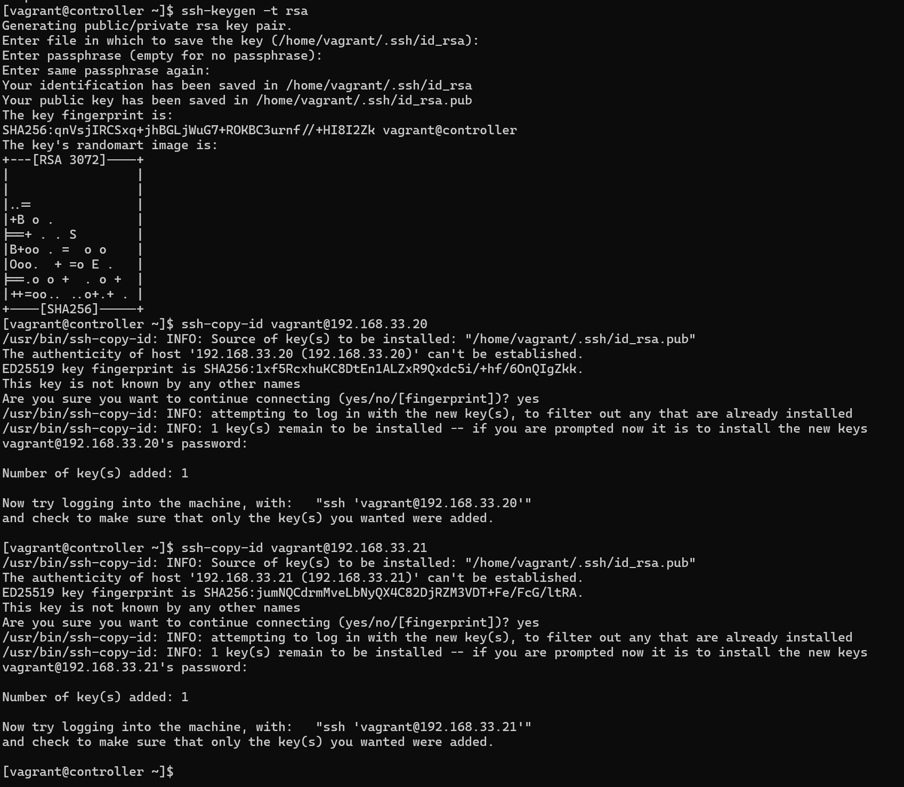

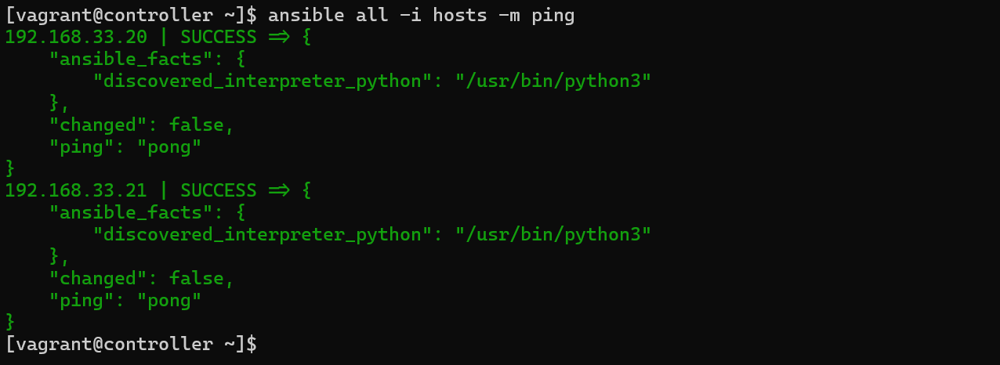


```
[vagrant@controller ~]$ ansible-playbook -i hosts playbook.yml -vvv
```

```
---
- name: Install and configure Nginx on web servers
  hosts: web
  become: true
  tasks:
    - name: Install Nginx
      yum:
        name: nginx
        state: present

    - name: Start and enable Nginx service
      service:
        name: nginx
        state: started
        enabled: true

- name: Install and configure MySQL on db servers
  hosts: db
  become: true
  vars:
    mysql_root_password: password
  tasks:
    - name: Install MySQL
      yum:
        name: mysql-server
        state: present

    - name: Start and enable MySQL service
      service:
        name: mysqld
        state: started
        enabled: true

    - name: Set MySQL root password
      mysql_user:
        name: root
        password: "{{ mysql_root_password }}"
        host: localhost
        state: present

```

```
Key Changes:
Naming: Changed play names to better describe their purposes.
Service Management: Used state: started instead of state: restarted and added enabled: true to ensure the services start on boot.
MySQL Installation: Changed the package name from mysql to mysql-server (commonly used package name for MySQL).
MySQL Service Name: Changed the service name to mysqld (typical name for MySQL service).
MySQL Root Password: Added a task to set the MySQL root password using the mysql_user module.
Feel free to adj
```

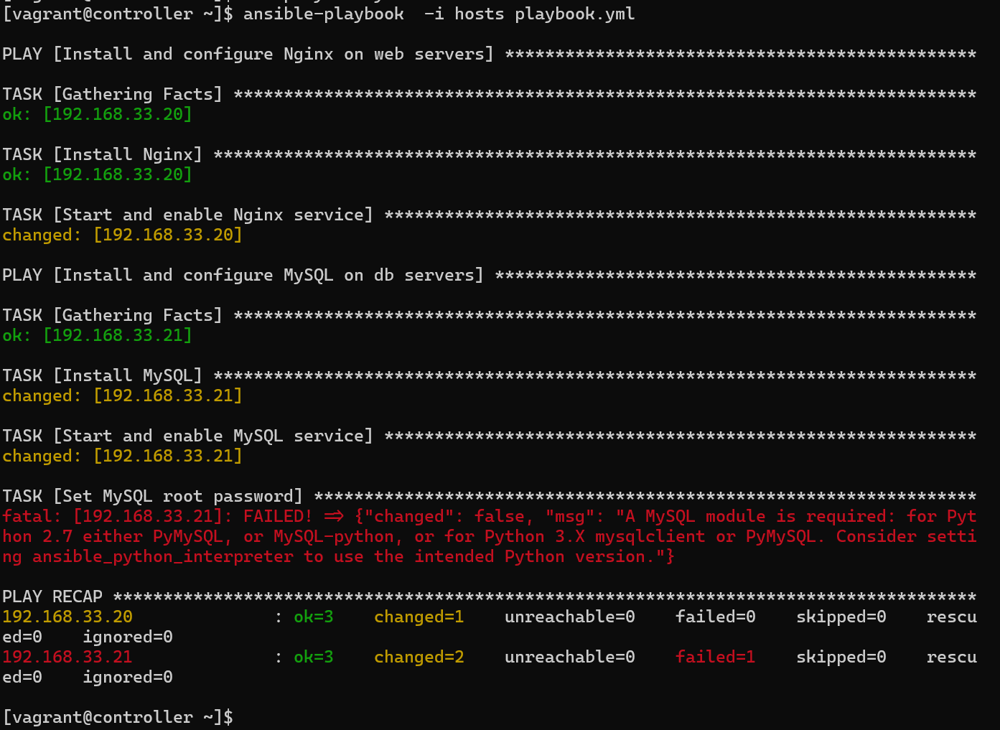

```
- name: Install and configure MySQL on db servers
  hosts: db
  become: true
  vars:
    mysql_root_password: password
    ansible_python_interpreter: /usr/bin/python3
    sql_file_path: create_tables.sql  # Update this path to your actual SQL file location
  tasks:
    - name: Install MySQL
      yum:
        name: mysql-server
        state: present

    - name: Start and enable MySQL service
      service:
        name: mysqld
        state: started
        enabled: true
        
    - name: Install python
      yum:
        name: python
        state: present

    - name: Install python-pip
      yum:
        name: python-pip
        state: present

    - name: Install PyMySQL Python library
      pip:
        name: PyMySQL
        state: present

    - name: Set MySQL root password
      mysql_user:
        name: root
        password: "{{ mysql_root_password }}"
        host: localhost
        state: present
      vars:
        ansible_python_interpreter: /usr/bin/python3

    - name: Create tables from SQL file
      mysql_db:
        name: mydatabase
        state: import
        target: "{{ sql_file_path }}"
        login_user: root
        login_password: "{{ mysql_root_password }}"
        login_host: localhost
```


```
CREATE DATABASE IF NOT EXISTS mydatabase;
USE mydatabase;

CREATE TABLE IF NOT EXISTS users (
    id INT AUTO_INCREMENT PRIMARY KEY,
    username VARCHAR(50) NOT NULL,
    password VARCHAR(255) NOT NULL
);

CREATE TABLE IF NOT EXISTS orders (
    id INT AUTO_INCREMENT PRIMARY KEY,
    user_id INT,
    order_date DATE,
    FOREIGN KEY (user_id) REFERENCES users(id)
);
```


```
- name: Install and configure MySQL on db servers
  hosts: db
  become: true
  vars:
    mysql_root_password: password
    ansible_python_interpreter: /usr/bin/python3
    sql_file_path: create_tables.sql  # Update this path to your actual SQL file location
  tasks:
    - name: Install MySQL
      yum:
        name: mysql-server
        state: present

    - name: Start and enable MySQL service
      service:
        name: mysqld
        state: started
        enabled: true
        
    - name: Install python
      yum:
        name: python
        state: present

    - name: Install python-pip
      yum:
        name: python-pip
        state: present

    - name: Install PyMySQL Python library
      pip:
        name: PyMySQL
        state: present

    - name: Set MySQL root password
      mysql_user:
        name: root
        password: "{{ mysql_root_password }}"
        host: localhost
        state: present
      vars:
        ansible_python_interpreter: /usr/bin/python3

    - name: Create tables from SQL file
      mysql_db:
        name: mydatabase
        state: import
        target: "{{ sql_file_path }}"
        login_user: root
        login_password: "{{ mysql_root_password }}"
        login_host: localhost
```