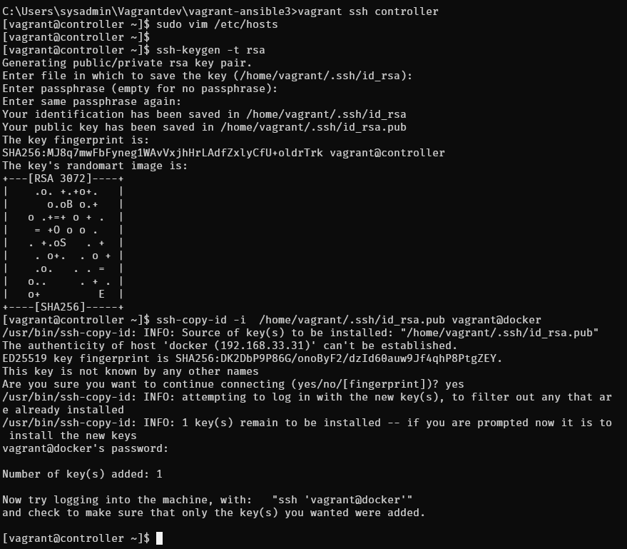

# Workshop Ansible2 - container

## Objective
- install docker engine with ansible บน Centos 9 stream
- manage docker container with ansible

```
C:\Users\sysadmin\Vagrantdev>mkdir vagrant-ansible3
```

content of Vagrantfile
- controller 192.168.33.30
- docker host 192.168.33.31
```
# -*- mode: ruby -*-
# vi: set ft=ruby :

# All Vagrant configuration is done below. The "2" in Vagrant.configure
# configures the configuration version (we support older styles for
# backwards compatibility). Please don't change it unless you know what
# you're doing.

$script=<<-SCRIPT
    sed -i 's/PasswordAuthentication no/PasswordAuthentication yes/g' /etc/ssh/sshd_config    
    systemctl restart sshd.service
SCRIPT

Vagrant.configure("2") do |config|
  # The most common configuration options are documented and commented below.
  # For a complete reference, please see the online documentation at
  # https://docs.vagrantup.com.
  config.vm.box = "generic/centos9s"

  config.vm.define "controller" do |control|
    control.vm.hostname = "controller"
    control.vm.network "private_network", ip: "192.168.33.30"
    control.vm.provider "virtualbox" do |vb|
      vb.memory = "1024"
      vb.cpus = 1
    end

    control.vm.provision "shell", inline: <<-SCRIPT
      sudo hostnamectl set-hostname controller
      sudo dnf install ansible -y
    SCRIPT
  end

  config.vm.define "web" do |web|
    web.vm.hostname = "docker"
    web.vm.network "private_network", ip: "192.168.33.31"
    web.vm.provider "virtualbox" do |vb|
      vb.memory = "4096"
      vb.cpus = 4
    end
    web.vm.provision "shell", inline: <<-SCRIPT
      sudo hostnamectl set-hostname docker
    SCRIPT
  end


  config.vm.synced_folder ".", "/vagrant"


  config.vm.provision "shell", inline: $script
end
```

**Step preparation เหมือนเดิม**

- เข้าไปใน Controller ติดตั้ง ansible
  ```
  vagrant ssh controller
  ```

- เพิ่ม ข้อมูลใน ```/etc/hosts``` ในเครื่อง Controller
  ```
  sudo vim /etc/hosts
  ```

  ```
  #ต่อท้าย ไฟล์
  192.168.33.30 controller controller
  192.168.33.31 docker docker
  ```
- ทำการ สร้าง ssh-key ในทุกเครื่อง (output ใน  ~/.ssh/)
- Copy คีย์ ด้วยคำสั่ง ssh-copy-id จาก controller ไปยัง docker



## LAB1  prepare file
- สร้าง inventory.ini

```
[vagrant@controller ~]$ vim inventory.ini
```

content:
```
[docker]
server1 ansible_host=192.168.33.31
```


- สร้าง docker_install.yml

```
[vagrant@controller ~]$ vim docker_install.yml
```

content:
- task1 install package
- task2 add repository
- task3 install docker
- task4 start docker service
- task5 add vagrant user to docker group

```
---
- name: Install Docker on CentOS 9 Stream
  hosts: docker
  become: yes
  gather_facts: yes
  vars:
    ansible_user: vagrant
  tasks:
    - name: Install required packages
      yum:
        name:
          - yum-utils
          - device-mapper-persistent-data
          - lvm2
        state: present

    - name: Add Docker repository
      ansible.builtin.yum_repository:
        name: docker-ce
        description: Docker CE Repository
        baseurl: https://download.docker.com/linux/centos/9/$basearch/nightly/
        enabled: yes
        gpgcheck: yes
        gpgkey: https://download.docker.com/linux/centos/gpg

    - name: Install Docker
      ansbible.builtin.yum:
        name:
          - docker-ce
          - docker-ce-cli
          - containerd.io
        state: latest

    - name: Start and enable Docker service
      ansible.builtin.service:
        name: docker
        state: started
        enabled: yes

    - name: Add user to the docker group
      ansible.builtin.user:
        name: "{{ ansible_user }}"
        groups: docker
        append: yes
        state: present

    - name: Install pip for Python 3
      ansible.builtin.yum:
        name: python3-pip
        state: present

    - name: Install Docker SDK for Python 3
      ansible.builtin.pip:
        name: docker
        executable: /usr/bin/pip3

```

- **Lab1 ทดสอบด้วยการ Run**
```
[vagrant@controller ~]$ ls
docker_install.yml  inventory.ini

[vagrant@controller ~]$ ansible-playbook -i inventory.ini docker_install.yml
```

## Enable Docker listen บน tcp

- ssh to docker
```
vagrant ssh docker
```
- Edit docker.service
```
$ sudo vim  /usr/lib/systemd/system/docker.service
```
- add ```-H tcp://0.0.0.0:2376```
```
ExecStart=/usr/bin/dockerd -H fd:// -H tcp://0.0.0.0:2376 --containerd=/run/containerd/containerd.sock
```


- Reload
```
$sudo systemctl daemon-reload
$sudo systemctl restart docker.service

$docker -H tcp://192.168.33.31:2376 info
```

- Add firewall
```
sudo firewall-cmd --add-port=2376/tcp --permanent
sudo firewall-cmd --reload
```
## LAB2  docker management

- สร้าง docker-mangement.yml

```
---
- name: Docker Management Playbook
  hosts: docker
  become: yes
  gather_facts: yes

  tasks:
    - name: Start Docker service
      service:
        name: docker
        state: started
        enabled: yes

    - name: Docker pull image
      community.docker.docker_image:
        name: hello-world
        source: pull
        state: present
        docker_host: tcp://192.168.33.31:2376

    - name: Start Docker container
      docker_container:
        name: hello_world_container
        image: hello-world:latest # Reference the previously pulled image
        state: started
        docker_host: tcp://192.168.33.31:2376
```

- Run Lab2
```
[vagrant@controller ~]$ ansible-playbook -i inventory.ini docker-management.yml
```

- Verify on docker host
```
[vagrant@docker ~]$ sudo docker images
REPOSITORY    TAG       IMAGE ID       CREATED         SIZE
hello-world   latest    d2c94e258dcb   16 months ago   13.3kB

[vagrant@docker ~]$ sudo docker ps -a
CONTAINER ID   IMAGE                COMMAND    CREATED          STATUS                      PORTS     NAMES
fdde613d6321   hello-world:latest   "/hello"   15 seconds ago   Exited (0) 13 seconds ago             hello_world_container

```

## Lab 3 docker build manaige
- create Dockerfile for build
  ```
  [vagrant@controller ~]$ vim Dockerfile
  ```
  content:

  ```
  FROM alpine:latest
  EXPOSE 8080
  CMD nc -l -p 8080
  ```

- add task to lab2 docker-management.yml

```
---
- name: Docker Management Playbook
  hosts: docker
  become: yes
  gather_facts: yes

  vars:
    docker_host_url: "tcp://192.168.33.31:2376"

  tasks:
    - name: Start Docker service
      service:
        name: docker
        state: started
        enabled: yes

    - name: Docker pull image
      community.docker.docker_image:
        name: hello-world
        source: pull
        state: present
        docker_host: "{{ docker_host_url }}"

    - name: Pull CentOS Stream 9 Docker image
      community.docker.docker_image:
        name: quay.io/centos/centos:stream9
        source: pull
        state: present
        docker_host: "{{ docker_host_url }}"

    - name: Docker pull image alpine
      community.docker.docker_image:
        name: alpine:latest
        source: pull
        state: present
        docker_host: "{{ docker_host_url }}"

    - name: Start Docker container
      docker_container:
        name: hello_world_container
        image: hello-world:latest # Reference the previously pulled image
        state: started
        docker_host: "{{ docker_host_url }}"

    - name: Create a directory
      ansible.builtin.file:
        path: /home/vagrant/demo
        state: directory
        mode: '0755'

    - name: copy file to docker host
      copy:
        src: ./Dockerfile
        dest: /home/vagrant/demo/Dockerfile

    - name: Build container image
      docker_image:
        name: democontainer:v1.0
        build:
          path: /home/vagrant/demo/
        state: present
        source: build
        docker_host: "{{ docker_host_url }}"
```

- Run
```
[vagrant@controller ~]$ ansible-playbook -i inventory.ini docker-management.yml
```

- Test on docker host
```
[vagrant@docker ~]$ docker images
REPOSITORY      TAG       IMAGE ID       CREATED              SIZE
democontainer   v1.0      38e9e7582132   About a minute ago   7.8MB
alpine          latest    324bc02ae123   5 weeks ago          7.8MB
hello-world     latest    d2c94e258dcb   16 months ago        13.3kB
```

- Run  ทำให้ vm docker
```
[vagrant@docker demo]$ sudo firewall-cmd --permanent --add-port=8080/tcp
success
[vagrant@docker demo]$ sudo firewall-cmd --reload
success
[vagrant@docker demo]$ docker run  --rm -it -p 8080:8080 democontainer:v1.0

```
- tpc socket will wait connection because ```nc command```

- เปิด อีก terminal ใน 
```
[vagrant@controller ~]$ telnet 192.168.33.31 8080
Trying 192.168.33.31...
Connected to 192.168.33.31.
Escape character is '^]'.
Sawassdee krab
```


- Result แสดงข้อความ ที่ส่งมา
```
[vagrant@docker demo]$ docker run  --rm -it -p 8080:8080 democontainer:v1.0
Sawassdee krab
```

