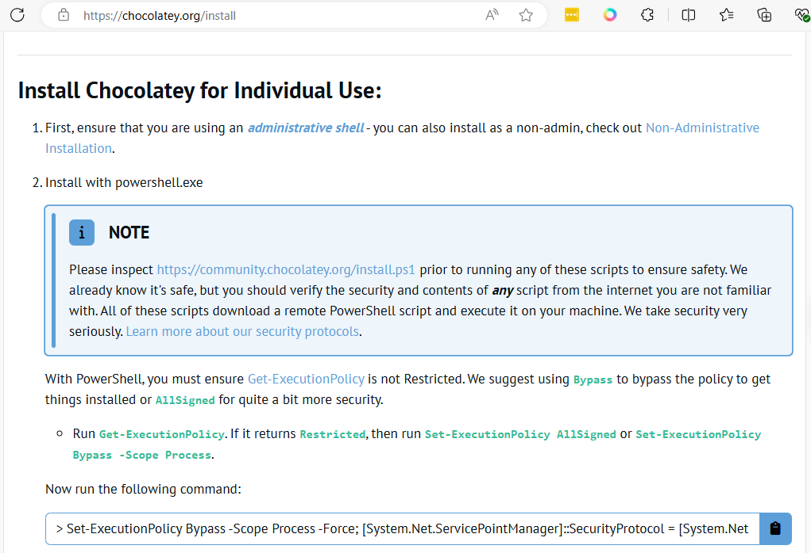
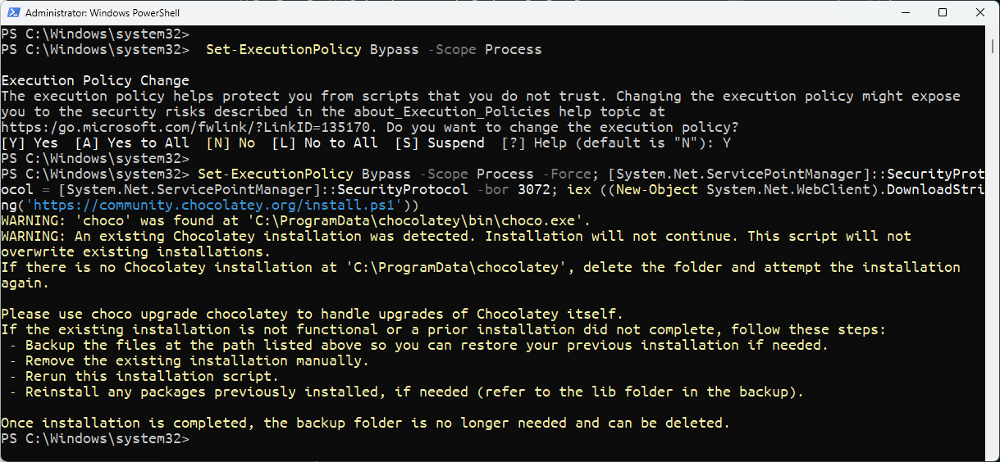
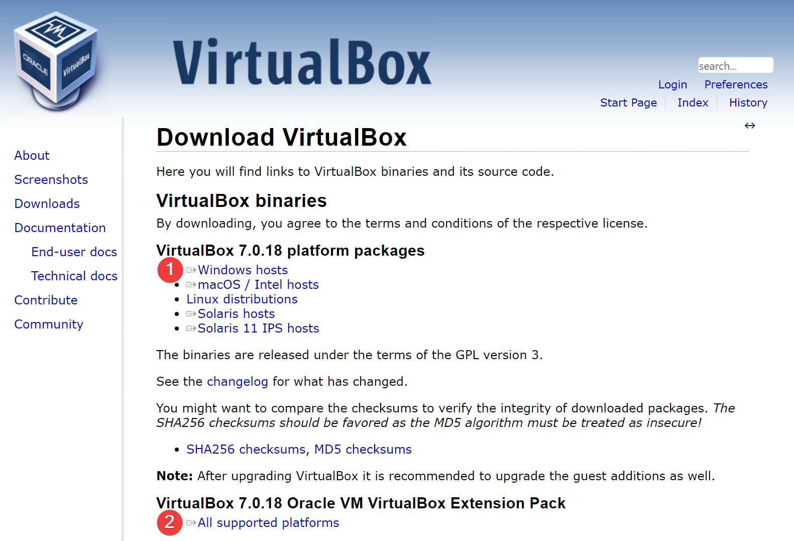
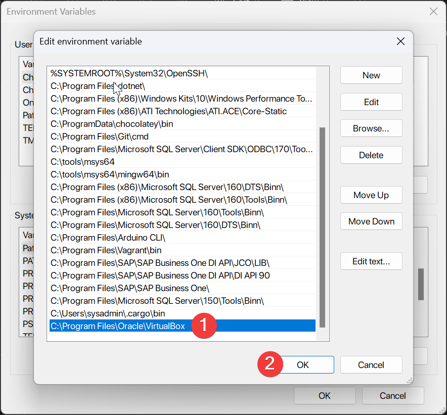
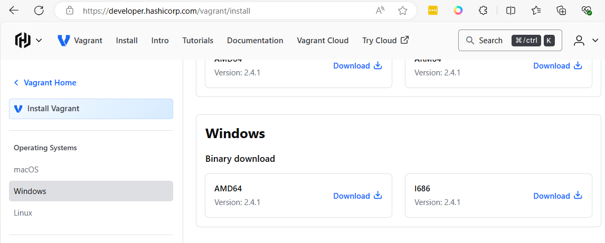
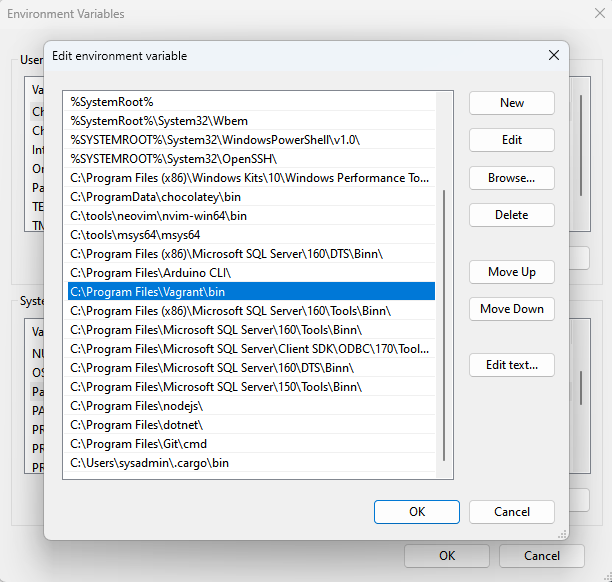
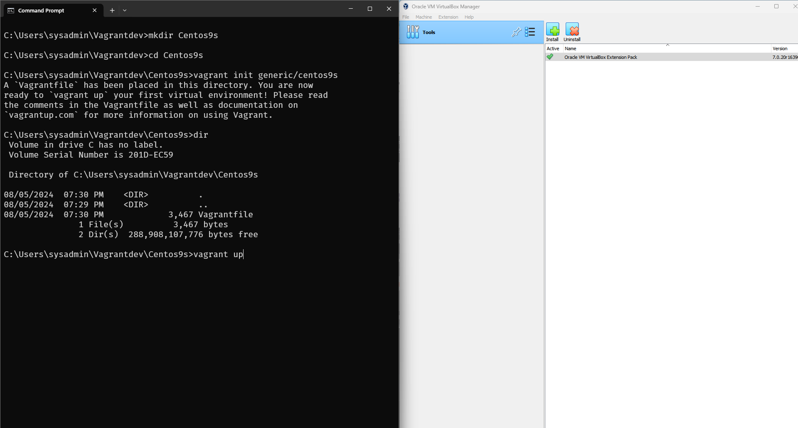
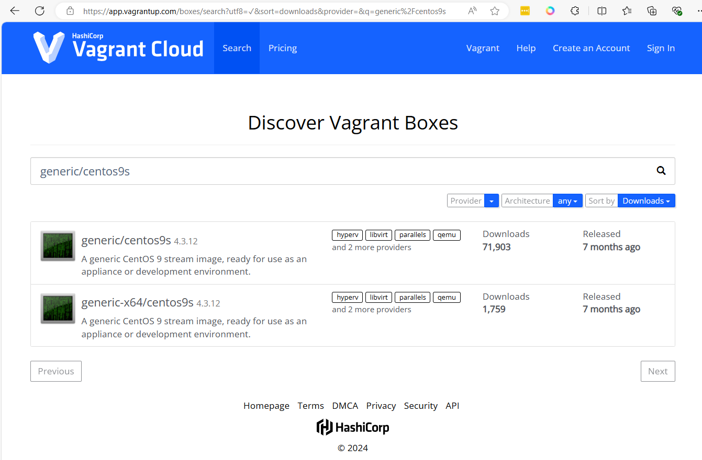
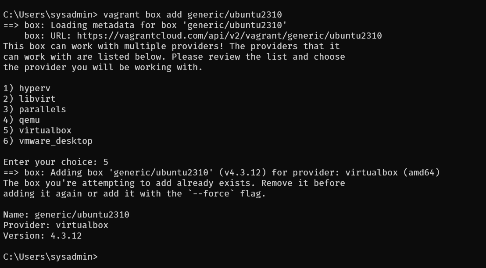

# ติดตั้ง Vagrant Tools ใน windows


1 web vagrant [https://www.vagrantup.com/](https://www.vagrantup.com/)


## เนื้อหา Course Objective
- create virutal machine in Oracle Virtualbox by using Vagrant
- Setup windows 11 to run Vagrant
- Create Vagrantfile and setup paramenter of VM
    - Understand network configuration
        - NAT network
        - Private network
        - Public network
    - File sync between Host and VM with package Rsync
    - Virtualization Customization
        - Customize number of CPU
        - Customize number of Memory
        - Customize Nested Virtualization
    - Download image from Vagrant Cloud
        - Ubuntu image
        - Rocky image

Vagrant เป็นเครื่องมือสำหรับการสร้างและจัดการสภาพแวดล้อมการพัฒนาซอฟต์แวร์แบบเสมือนจริง (virtualized development environments) มันช่วยให้นักพัฒนาซอฟต์แวร์สามารถสร้างและกำหนดค่าการพัฒนาได้อย่างง่ายดายและรวดเร็ว โดยไม่ต้องกังวลเกี่ยวกับความแตกต่างของสภาพแวดล้อมการพัฒนาระหว่างทีมงานหรือเครื่องต่างๆ 

### คุณสมบัติของ Vagrant
- **การสร้างและจัดการ VM (Virtual Machines)**: Vagrant ช่วยให้สามารถสร้างและจัดการเครื่องเสมือนบนหลายแพลตฟอร์มเช่น VirtualBox, VMware, AWS, Docker ฯลฯ
- **การกำหนดค่าโดยใช้ไฟล์ Vagrantfile**: นักพัฒนาสามารถกำหนดค่าการตั้งค่าเครื่องเสมือนผ่านไฟล์ Vagrantfile ซึ่งเป็นไฟล์ข้อความธรรมดาที่ระบุการตั้งค่าต่างๆ เช่น ระบบปฏิบัติการ ซอฟต์แวร์ที่ต้องติดตั้ง และการตั้งค่าเครือข่าย
- **การแบ่งปันสภาพแวดล้อม**: นักพัฒนาสามารถแบ่งปันสภาพแวดล้อมการพัฒนากับสมาชิกในทีมได้ง่ายๆ เพียงแค่แชร์ไฟล์ Vagrantfile ทำให้ทุกคนสามารถมีสภาพแวดล้อมการพัฒนาที่เหมือนกัน
- **การจัดการโปรวิชั่น (Provisioning)**: Vagrant รองรับการโปรวิชั่นโดยใช้เครื่องมือต่างๆ เช่น Shell scripts, Ansible, Chef, Puppet ทำให้นักพัฒนาสามารถติดตั้งและกำหนดค่าซอฟต์แวร์ในเครื่องเสมือนได้อย่างอัตโนมัติ

### ประโยชน์ของ Vagrant
- **สภาพแวดล้อมที่สม่ำเสมอ**: ลดปัญหาที่เกิดจากความแตกต่างของสภาพแวดล้อมการพัฒนา เช่น "works on my machine" ปัญหา
- **การตั้งค่าที่รวดเร็วและง่ายดาย**: ช่วยลดเวลาในการตั้งค่าสภาพแวดล้อมการพัฒนา
- **การทำงานร่วมกันที่ดีขึ้น**: ทำให้ทีมงานสามารถทำงานร่วมกันได้อย่างมีประสิทธิภาพมากขึ้นโดยไม่ต้องกังวลเกี่ยวกับสภาพแวดล้อมที่แตกต่างกัน
- **การทดลองและทดสอบได้ง่าย**: นักพัฒนาสามารถทดลองและทดสอบซอฟต์แวร์ในสภาพแวดล้อมที่ควบคุมได้

### การใช้งานเบื้องต้น
1. **ติดตั้ง Vagrant**: ดาวน์โหลดและติดตั้ง Vagrant จาก [เว็บไซต์ Vagrant](https://www.vagrantup.com/)
2. **สร้างโปรเจคใหม่**: สร้างไดเรกทอรีใหม่และรันคำสั่ง `vagrant init` เพื่อสร้างไฟล์ Vagrantfile
3. **กำหนดค่า Vagrantfile**: แก้ไขไฟล์ Vagrantfile เพื่อกำหนดค่าการตั้งค่าต่างๆ ของเครื่องเสมือน
4. **เริ่มเครื่องเสมือน**: รันคำสั่ง `vagrant up` เพื่อสร้างและเริ่มเครื่องเสมือน
5. **เชื่อมต่อกับเครื่องเสมือน**: รันคำสั่ง `vagrant ssh` เพื่อเชื่อมต่อกับเครื่องเสมือนผ่าน SSH

Vagrant เป็นเครื่องมือที่มีประโยชน์มากสำหรับนักพัฒนาซอฟต์แวร์ที่ต้องการสร้างและจัดการสภาพแวดล้อมการพัฒนาแบบเสมือนจริงอย่างมีประสิทธิภาพ


## Step1 ปิดการทำงานของ HyperV
Run Setup command in Powershell
Open Powershell with Adminstrator mode
Run:
```
PS > Disable-WindowsOptionalFeature -Online -FeatureName Microsoft-Hyper-V-All
```
Run:
```
PS > bcdedit /set hypervisorlaunchtype off
```
Run:
```
PS > DISM /Online /Disable-Feature:Microsoft-Hyper-V
```

## Step2 ติดตั้ง Rsync ผ่านทาง Chocolatey
Chocolatey เป็นเครื่องมือสำหรับการจัดการแพ็คเกจ (package manager) บน Windows ซึ่งช่วยให้ผู้ใช้สามารถติดตั้ง อัปเดต และจัดการซอฟต์แวร์ได้ง่ายขึ้น มันทำงานคล้ายกับตัวจัดการแพ็คเกจบนระบบปฏิบัติการ Unix อย่าง apt บน Debian/Ubuntu หรือ yum บน CentOS/RHEL

### คุณสมบัติของ Chocolatey
- **การติดตั้งซอฟต์แวร์อย่างง่ายดาย**: สามารถติดตั้งซอฟต์แวร์ต่างๆ ได้อย่างง่ายดายผ่านคำสั่งเดียว
- **การจัดการการอัปเดต**: สามารถอัปเดตซอฟต์แวร์ให้เป็นเวอร์ชันล่าสุดได้อย่างรวดเร็ว
- **การลบซอฟต์แวร์**: สามารถลบซอฟต์แวร์ที่ติดตั้งด้วย Chocolatey ได้อย่างง่ายดาย
- **การจัดการแพ็คเกจ**: รองรับการติดตั้งหลายแพ็คเกจพร้อมกัน การสร้างสคริปต์สำหรับการติดตั้งซอฟต์แวร์หลายๆ ตัว เป็นต้น


ติดตั้ง chocolatey บน windows 11 [https://chocolatey.org/install](https://chocolatey.org/install)  และทำตามคำแนะนำ


Run:
```
> Set-ExecutionPolicy Bypass -Scope Process

> Set-ExecutionPolicy Bypass -Scope Process -Force; [System.Net.ServicePointManager]::SecurityProtocol = [System.Net.ServicePointManager]::SecurityProtocol -bor 3072; iex ((New-Object System.Net.WebClient).DownloadString('https://community.chocolatey.org/install.ps1'))
```
Restart Windows Powershell



Run: ติดตั้ง Rsync
```
> choco install rsync
```

## Step3 ติดตั้ง virtualbox บน Windows
1. เปิด link [https://www.virtualbox.org/wiki/Downloads](https://www.virtualbox.org/wiki/Downloads)
1. Download  Virtualbox and Extension pack


```admonish
Choose virtualbox for your os
```

## Step4 เพิ่ม C:\Program Files\Oracle\VirtualBox to path environment
เพื่อให้สามารถใช้คำสั่งของ virtualbox ผ่าน Command line
1. Press the Start key on your keyboard.
1. Search and open “Edit the system environment variables.”
1. Go to the “Advanced” tab.
1. Click the “Environment variables” button.
1. Select the “Path” variable under “User variables” or “System variables.”
1. Click the “Edit” button.
1. Press the “New” button.
1. Type the full directory path of the program.
1. Press “Enter” to confirm the path. 
1. Click “Ok.”
1. Press the “Ok” button in the Environment Variables window.
1. Click “Ok” in the System Variables window.




## Step5 คิดคั้ง Install Vagrant

1. เปิด Link [https://developer.hashicorp.com/vagrant/install](https://developer.hashicorp.com/vagrant/install)



ตรวจสอบ ว่า มี C:\Program Files\Vagrant\bin อยู่ใน path ของ Windows หรือไม่


ทดสอบ command ใน Terminal

```
C:\Users\sysadmin>vagrant --version
Vagrant 2.4.1

C:\Users\sysadmin>vagrant --help
Usage: vagrant [options] <command> [<args>]

    -h, --help                       Print this help.

Common commands:
     autocomplete    manages autocomplete installation on host
     box             manages boxes: installation, removal, etc.
     cloud           manages everything related to Vagrant Cloud
     destroy         stops and deletes all traces of the vagrant machine
     global-status   outputs status Vagrant environments for this user
     halt            stops the vagrant machine
     help            shows the help for a subcommand
     init            initializes a new Vagrant environment by creating a Vagrantfile
     login
     package         packages a running vagrant environment into a box
     plugin          manages plugins: install, uninstall, update, etc.
     port            displays information about guest port mappings
     powershell      connects to machine via powershell remoting
     provision       provisions the vagrant machine
     push            deploys code in this environment to a configured destination
     rdp             connects to machine via RDP
     reload          restarts vagrant machine, loads new Vagrantfile configuration
     resume          resume a suspended vagrant machine
     serve           start Vagrant server
     snapshot        manages snapshots: saving, restoring, etc.
     ssh             connects to machine via SSH
     ssh-config      outputs OpenSSH valid configuration to connect to the machine
     status          outputs status of the vagrant machine
     suspend         suspends the machine
     up              starts and provisions the vagrant environment
     upload          upload to machine via communicator
     validate        validates the Vagrantfile
     version         prints current and latest Vagrant version
     winrm           executes commands on a machine via WinRM
     winrm-config    outputs WinRM configuration to connect to the machine

For help on any individual command run `vagrant COMMAND -h`

Additional subcommands are available, but are either more advanced
or not commonly used. To see all subcommands, run the command
`vagrant list-commands`.
        --[no-]color                 Enable or disable color output
        --machine-readable           Enable machine readable output
    -v, --version                    Display Vagrant version
        --debug                      Enable debug output
        --timestamp                  Enable timestamps on log output
        --debug-timestamp            Enable debug output with timestamps
        --no-tty                     Enable non-interactive output

C:\Users\sysadmin>
```

### Step6 Basic Vagrantfile
ให้สร้าง folder VagrantDev เพื่อใช้เป็น Project folder ก่อน

```
C:\Users\sysadmin> mkdir Vagrantdev
C:\Users\sysadmin> cd Vagrantdev
C:\Users\sysadmin> mkdir Centos9s
C:\Users\sysadmin> cd Centos9s
C:\Users\sysadmin> vagrant init generic/centos9s
C:\Users\sysadmin> vagrant up
```



### ผลคำสั่ง
1. vagrant init สร้าง file ชื่อ Vagrantfile
2. Vagrant up จะทำการ Download image จาก Vagrant Cloud [https://app.vagrantup.com/boxes/search](https://app.vagrantup.com/boxes/search)



### Step7 Download image แบบ manual
```
C:\Users\sysadmin> vagrant box add generic/ubuntu2310
```
เลือก ชนิด Hypervisor เป็น Virtualbox (หมายเลข 5)




## Step 8 สรุปคำสั่งพื้นฐานของ Vagrant

### คำสั่ง Download Vagrant box

- `vagrant box add <image-name>`
  - แทน image-name ด้วยชื่อของ image เช่น `generic/centos9s`

### การตั้งค่าและการจัดการเครื่องเสมือน

- `vagrant init`
  - สร้างไฟล์ `Vagrantfile` ในไดเรกทอรีปัจจุบัน
- `vagrant up` หรือ `vagrant up --provider=virtualbox`
  - สร้างและเริ่มเครื่องเสมือนตามการตั้งค่าใน `Vagrantfile`
- `vagrant ssh`
  - เชื่อมต่อกับเครื่องเสมือนผ่าน SSH
- `vagrant halt`
  - ปิดเครื่องเสมือน
- `vagrant destroy`
  - ลบเครื่องเสมือน

## การจัดการการตั้งค่าและการโปรวิชั่น

- `vagrant reload`
  - รีสตาร์ทเครื่องเสมือนและโหลดการตั้งค่าใหม่จาก `Vagrantfile` แต่ไม่ Run provision
- `vagrant reload --provision`
  - Force ให้ Run provision ด้วย ขณะที่มีการ Reload
- `vagrant provision`
  - รันโปรวิชั่นเนอร์ที่กำหนดไว้ใน `Vagrantfile`

## การตรวจสอบสถานะและข้อมูลเครื่องเสมือน

- `vagrant status`
  - แสดงสถานะปัจจุบันของเครื่องเสมือน
- `vagrant global-status`
  - แสดงสถานะของเครื่องเสมือนทั้งหมดที่จัดการโดย Vagrant บนเครื่องคอมพิวเตอร์นั้นๆ
- `vagrant ssh-config`
  - แสดงการตั้งค่า SSH สำหรับเชื่อมต่อกับเครื่องเสมือน

## การจัดการสแน็ปช็อต

- `vagrant snapshot save [ชื่อสแน็ปช็อต]`
  - บันทึกสถานะปัจจุบันของเครื่องเสมือนเป็นสแน็ปช็อต
- `vagrant snapshot restore [ชื่อสแน็ปช็อต]`
  - กู้คืนสถานะเครื่องเสมือนจากสแน็ปช็อตที่บันทึกไว้
- `vagrant snapshot list`
  - แสดงรายการสแน็ปช็อตทั้งหมดของเครื่องเสมือน
- `vagrant snapshot delete [ชื่อสแน็ปช็อต]`
  - ลบสแน็ปช็อตที่ระบุ

## การซิงค์ไฟล์และโฟลเดอร์

- `vagrant rsync`
  - ซิงค์ไฟล์จากโฮสต์ไปยังเครื่องเสมือนด้วย rsync
- `vagrant rsync-auto`
  - ซิงค์ไฟล์จากโฮสต์ไปยังเครื่องเสมือนโดยอัตโนมัติเมื่อมีการเปลี่ยนแปลงไฟล์

การใช้คำสั่งเหล่านี้ช่วยให้คุณสามารถจัดการเครื่องเสมือนได้อย่างง่ายดายและมีประสิทธิภาพในกระบวนการพัฒนาซอฟต์แวร์


### Run Vagrant provisioning