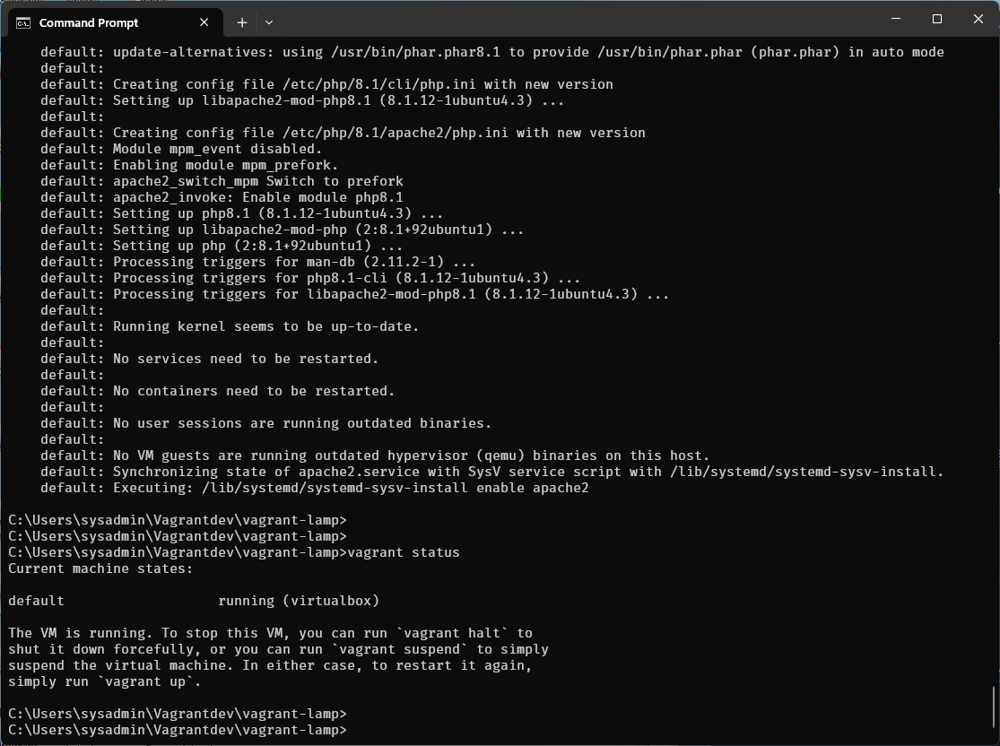
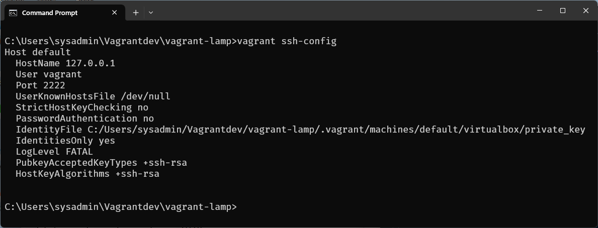
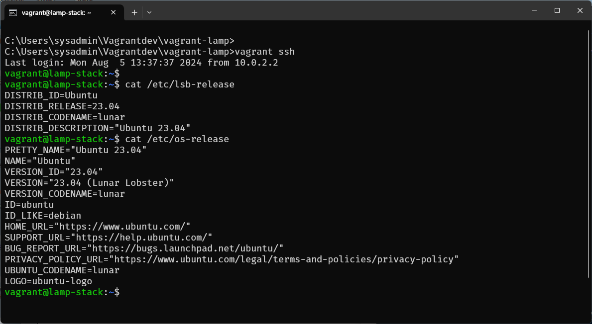
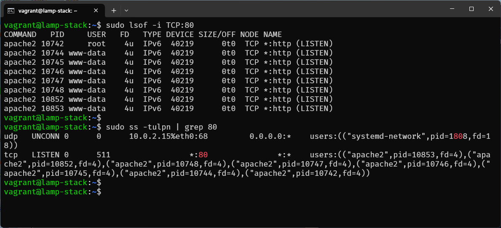
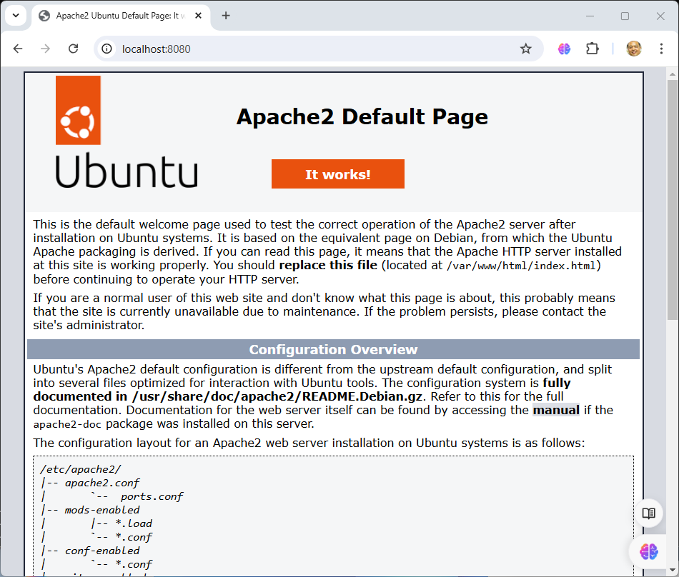
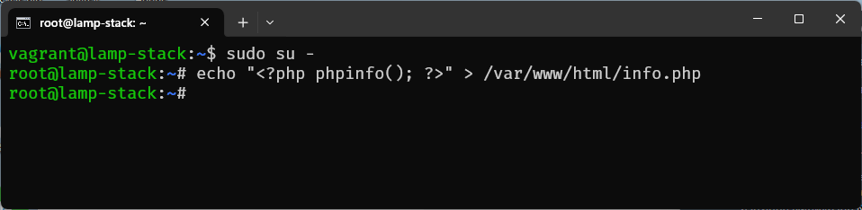
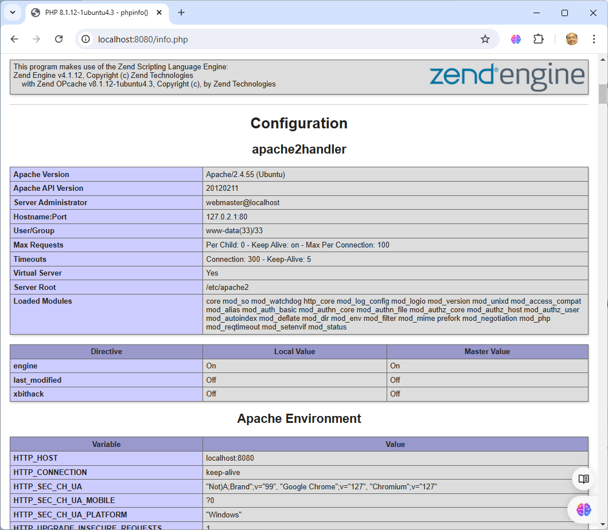
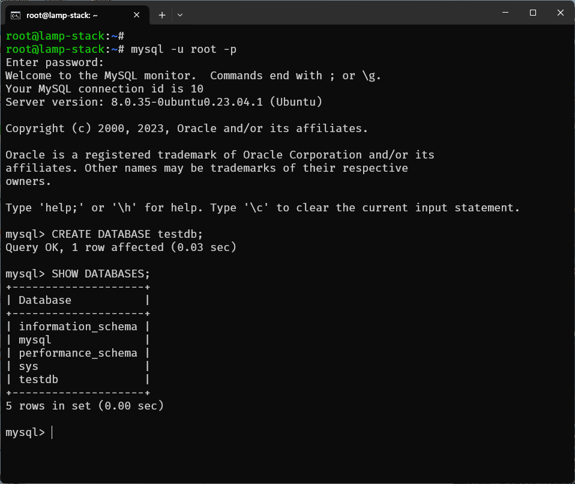

# Vagrant Workshop: Single Node LAMP Stack

## วัตถุประสงค์
เรียนรู้วิธีการสร้างและจัดการสภาพแวดล้อม LAMP (Linux, Apache, MySQL, PHP) บน VM(VM) โดยใช้ Vagrant

## ขั้นตอนการสร้าง Single Node LAMP Stack ด้วย Vagrant

### 1. การตั้งค่าโปรเจค
1. เปิดเทอร์มินัลหรือ PowerShell
2. สร้างไดเรกทอรีใหม่สำหรับโปรเจค
    ```sh
    mkdir vagrant-lamp
    cd vagrant-lamp
    ```
3. รันคำสั่ง `vagrant init` เพื่อสร้างไฟล์ `Vagrantfile`
    ```sh
    vagrant init generic/ubuntu2304
    ```

### 2. การกำหนดค่า Vagrantfile
เปิดไฟล์ `Vagrantfile` และแก้ไขดังนี้:
```ruby
Vagrant.configure("2") do |config|
  # เลือก box ที่จะใช้
  config.vm.box = "generic/ubuntu2304"

  # กำหนด hostname
  config.vm.hostname = "lamp-stack"

  # การตั้งค่าเครือข่าย
  config.vm.network "private_network", ip: "192.168.33.10"
  config.vm.network "forwarded_port", guest: 80, host: 8080
  # การติดตั้ง Apache, MySQL, PHP
  config.vm.provision "shell", inline: <<-SHELL
    apt-get update
    apt-get install -y apache2
    apt-get install -y mysql-server
    apt-get install -y php libapache2-mod-php php-mysql
    systemctl enable apache2
    systemctl start apache2
  SHELL
end
```

### 3. การเริ่มต้น VM
รันคำสั่ง vagrant up เพื่อสร้างและเริ่มต้นเครื่องเสมือน

```
vagrant up --provider=virtualbox --provision
```


ตรวจสอบ ssh-config
```
vagrant ssh-config
```


รันคำสั่ง vagrant ssh เพื่อเชื่อมต่อกับเครื่องเสมือนผ่าน SSH

```
vagrant ssh
```



### การใช้คำสั่ง lsof 

```admonish
The lsof command, in combination with other tools like top or ps, can be very helpful when diagnosing network issue.

$ sudo lsof -i TCP:22
```

คำอธิบายแต่ละ Colume:  

- **COMMAND:** The command name
- **PID:** Process ID (PID) of the process
- **USER:** Owner of the process
- **FD:** File descriptor definition
- **TYPE:** Type of file descriptor
- **DEVICE:** Device number or, in the case of a block device, character or other
- **SIZE/OFF:** Dimension of the file or offset (the suffix `0t` is the offset)
- **NODE:** Node description of the local file; this could be the number of the local file, TCP, UDP, or STR (stream)
- **NAME:** The name of the mount point where the file resides


```
$ sudo lsof -i TCP:22
```



### 4. การทดสอบ Apache
เปิดเว็บเบราว์เซอร์และเข้าไปที่ http://localhost:8080 หากทุกอย่างถูกตั้งค่าอย่างถูกต้อง คุณควรเห็นหน้าเริ่มต้นของ Apache



### 5. การทดสอบ PHP
สร้างไฟล์ PHP เพื่อทดสอบการทำงานของ PHP

```
$ sudo su -
# echo "<?php phpinfo(); ?>" > /var/www/html/info.php
```


เปิดเว็บเบราว์เซอร์และเข้าไปที่ http://localhost:8080/info.php ควรเห็นหน้าแสดงข้อมูล PHP



### 6. การทดสอบ MySQL
เชื่อมต่อกับ MySQL โดยใช้คำสั่งต่อไปนี้:
โดยให้เปลี่ยน เป็น user root ก่อน
```
$ sudo su -
# mysql -u root -p
```
ค่าเริ่มต้นจะเป็นค่าว่าง กด Enter เพื่อเข้าสู่ MySQL shell
รันคำสั่งต่อไปนี้เพื่อสร้างฐานข้อมูลทดสอบ:

```sql
CREATE DATABASE testdb;
SHOW DATABASES;
```



### 7.การจัดการเครื่องเสมือน
ปิด VM

```
vagrant halt
```

ลบ VM
```
vagrant destroy
```

###  สรุป
การใช้ Vagrant สำหรับการตั้งค่า LAMP stack จะช่วยให้คุณสามารถสร้างสภาพแวดล้อมการพัฒนาที่สม่ำเสมอและสามารถทำซ้ำได้ง่ายดาย เมื่อคุณมี Vagrantfile คุณสามารถแบ่งปันไฟล์นี้กับทีมของคุณเพื่อให้ทุกคนสามารถใช้สภาพแวดล้อมการพัฒนาเดียวกันได้